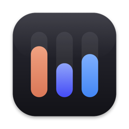
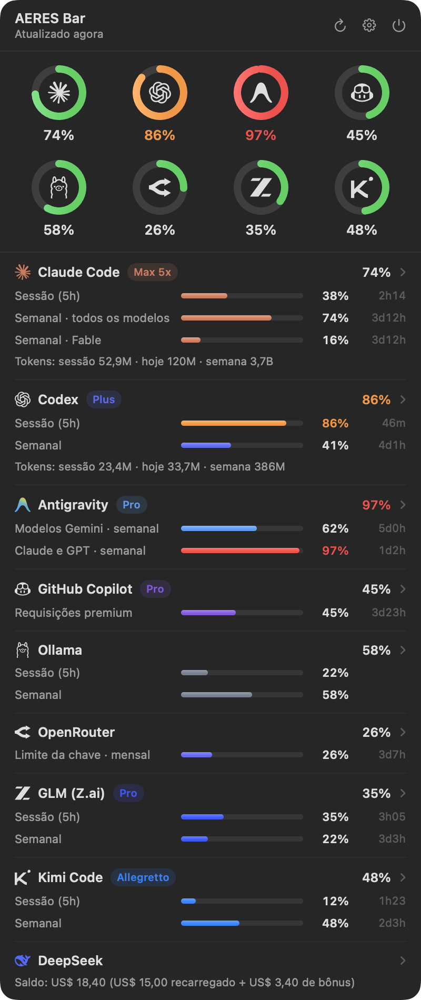
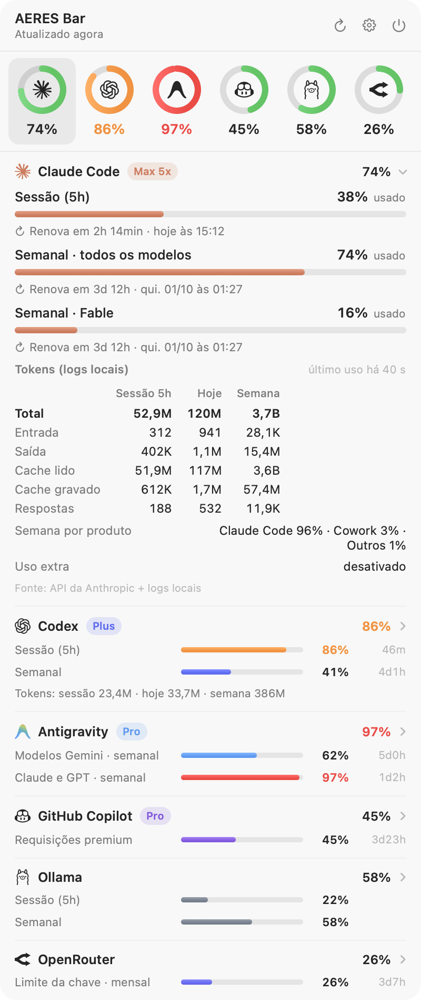
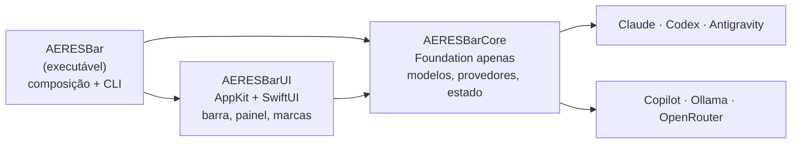

<p align="center">
  
</p>

<h1 align="center">AERES Bar</h1>

<p align="center">
  Consumo, limites e renovação do <b>Claude Code</b>, do <b>Codex</b>, do <b>Antigravity</b>, do <b>GitHub Copilot</b>, do <b>Ollama</b> e do <b>OpenRouter</b> num só item da barra de menus do macOS.
</p>

<p align="center">
  <a href="https://github.com/aeresdigital/aeres-bar/actions/workflows/ci.yml"></a>
  
  
  
</p>

<p align="center">
  
</p>

<table align="center">
  <tr>
    <td></td>
    <td></td>
  </tr>
</table>

<p align="center"><sub>Imagens geradas com dados de exemplo (<code>make docs-images</code>).</sub></p>

---

## Sumário

- [Funcionalidades](#funcionalidades)
- [Requisitos](#requisitos)
- [Instalação](#instalação)
- [Como usar](#como-usar)
- [Chaves de API (OpenRouter e Ollama Cloud)](#chaves-de-api-openrouter-e-ollama-cloud)
- [De onde vêm os números](#de-onde-vêm-os-números)
- [Privacidade e segurança](#privacidade-e-segurança)
- [Solução de problemas](#solução-de-problemas)
- [Desenvolvimento](#desenvolvimento)
- [CI/CD e releases](#cicd-e-releases)
- [Marcas](#marcas)
- [Licença](#licença)

## Funcionalidades

- **Um só item na barra de menus**, para ocupar pouco espaço: um medidor com uma barra por provedor, cheia até o uso de cada um, e ao lado a porcentagem do provedor mais perto do limite. Dá para trocar o medidor pelo logo do provedor mais crítico ou esconder o número e deixar só o ícone.
- **Número configurável:** limite mais crítico (padrão), janela principal, semanal ou tokens de hoje (somados); em % usada ou restante; com contagem regressiva opcional (`74% · 3d12h`).
- **Alertas visuais:** o número fica laranja a partir de 80% e vermelho a partir de 95%.
- **Painel ao passar o mouse** com todos os provedores de uma vez. Cada janela de limite ocupa uma linha, com barra de progresso, % usado e quanto falta para renovar. Clicar num provedor abre os detalhes:
  - quanto falta para renovar e quando: `Renova em 1h 17min · hoje às 05:10`;
  - tokens gastos na sessão, hoje e na semana (entrada, saída, cache lido e gravado, respostas);
  - plano da conta, uso extra, divisão do uso semanal por produto, cota por modelo, gasto e saldo.
- **Seis provedores:** Claude Code, Codex, Antigravity, GitHub Copilot, Ollama (Cloud e servidor local) e OpenRouter. Cada um pode ser desligado no menu; os que não estão configurados aparecem no rodapé do painel, com um atalho para configurar.
- **Clique** fixa o painel (fecha com clique fora ou Esc). **Clique direito** abre os ajustes.
- **Atualização automática** a cada 1–10 min, ao acordar o Mac e quando o Antigravity abre ou fecha. **Atualizar agora** (no painel ou no menu) consulta as APIs na hora. Um dado já lido nunca some: sem conexão ou com a ferramenta fechada, o painel mostra a última leitura e zera as janelas cujo horário de renovação já passou.
- **Abre com o macOS** (dá para desligar no menu).
- **Leve:** praticamente 0% de CPU em repouso e cerca de 25 MB de memória com o painel fechado. A leitura dos logs é incremental: a primeira passada pelos logs dos últimos 8 dias leva alguns segundos em segundo plano (1,8 GB em ~5 s num Mac com Apple Silicon); as seguintes leem só os bytes novos, em ~0,1 s.

## Requisitos

- macOS 14 Sonoma ou mais recente (Apple Silicon ou Intel).
- As ferramentas que você quer acompanhar, instaladas e com login:
  - [Claude Code](https://claude.com/claude-code), [Codex CLI](https://github.com/openai/codex) (login com ChatGPT) e/ou [Antigravity](https://antigravity.google);
  - GitHub Copilot: o login do [GitHub CLI](https://cli.github.com) (`gh auth login`) ou de um plugin do Copilot para Vim, Neovim, JetBrains ou Xcode;
  - Ollama e OpenRouter: uma chave de API (veja [Chaves de API](#chaves-de-api-openrouter-e-ollama-cloud)). Sem chave, o Ollama mostra só o servidor local.
- Para compilar: Xcode 26 ou mais recente (o CI compila com o Xcode 26.6 e o Swift 6.3).

## Instalação

### Pelo DMG

1. Baixe o DMG:
   - de uma versão publicada, em [Releases](https://github.com/aeresdigital/aeres-bar/releases) (`AERES-Bar-x.y.z.dmg`, com o `.sha256` ao lado). Ainda não há versão publicada: a primeira sai quando for criada uma tag `vX.Y.Z` (veja [Publicar uma versão](#publicar-uma-versão));
   - ou a versão de desenvolvimento, gerada a cada push na `main`: em [Actions › CI](https://github.com/aeresdigital/aeres-bar/actions/workflows/ci.yml), abra a execução mais recente da `main` e baixe o artefato `AERES-Bar-<commit>` (fica disponível por 14 dias).
2. Abra o DMG e arraste o **AERES Bar** para **Aplicativos**.
3. Abra o app. Sem assinatura Developer ID, o macOS bloqueia a primeira abertura. No macOS 15 ou mais recente, vá em **Ajustes do Sistema › Privacidade e Segurança** e clique em **Abrir Mesmo Assim**; no macOS 14, clique com o botão direito no app › **Abrir**. Pelo Terminal, dá no mesmo:

   ```bash
   xattr -dr com.apple.quarantine "/Applications/AERES Bar.app"
   ```

### Pelo código-fonte

```bash
git clone https://github.com/aeresdigital/aeres-bar.git
cd aeres-bar
make install
```

O repositório é privado: o `git clone` pede uma conta com acesso. `make install` compila em modo release, instala em `/Applications/AERES Bar.app` (substituindo uma versão anterior) e abre o app.

### Desinstalar

```bash
make uninstall
```

Desliga a abertura no login, encerra o app e apaga o app, o cache, as preferências e as chaves de API que ele guardou no Chaves.

## Como usar

| Gesto | Resultado |
| --- | --- |
| Passar o mouse sobre o item | Abre o painel com todos os provedores |
| Clicar num provedor no painel | Abre ou fecha os detalhes dele |
| Clique no item | Fixa o painel; clique fora ou Esc fecha |
| Clique direito (ou ⌃-clique) | Menu de ajustes |
| ⌘-arrastar o item | Muda a posição dele na barra (posição salva) |

**Ajustes** (clique direito, ou ⚙︎ no topo do painel):

- **Provedores:** liga ou desliga cada provedor. Desligado, ele não é consultado nem aparece. O último não pode ser desligado.
- **Chaves de API:** define, troca ou remove as chaves do OpenRouter e do Ollama Cloud, e abre a página onde criá-las.
- **Ícone na barra:** medidores de todos os provedores (padrão) ou o logo do provedor mais crítico.
- **Número na barra:** limite mais crítico, janela principal, limite semanal ou tokens de hoje.
- **Mostrar o número ao lado do ícone** (desligado, fica só o ícone), **Mostrar % restante**, **Mostrar tempo até renovar** e **Cores de alerta**.
- **Atualizar a cada:** 1, 2 (padrão), 5 ou 10 minutos.
- **Abrir ao iniciar o macOS.**

## Chaves de API (OpenRouter e Ollama Cloud)

O OpenRouter e o Ollama Cloud não deixam um login no Mac que o app possa reaproveitar, então pedem uma chave:

| Serviço | Onde criar | Tipo de chave |
| --- | --- | --- |
| OpenRouter | [openrouter.ai/settings/keys](https://openrouter.ai/settings/keys) | Qualquer chave (`sk-or-v1-…`). Com uma chave de gerenciamento, o painel também mostra o saldo de créditos |
| Ollama Cloud | [ollama.com/settings/keys](https://ollama.com/settings/keys) | Chave da API da sua conta |

Para guardar a chave, use **Ajustes › Chaves de API › Definir a chave…** e cole-a no campo protegido. Pelo Terminal, o app pede a chave sem mostrá-la na tela:

```bash
"/Applications/AERES Bar.app/Contents/MacOS/AERESBar" --set-key openrouter
```

Também dá para passar a chave por um pipe, por exemplo `pbpaste | "/Applications/AERES Bar.app/Contents/MacOS/AERESBar" --set-key ollama`. Para apagar, use `--delete-key openrouter` ou `--delete-key ollama`. Sem chave guardada, o app usa as variáveis `OPENROUTER_API_KEY` e `OLLAMA_API_KEY`, se existirem no ambiente dele.

## De onde vêm os números

| Provedor | Limites e horários de renovação | Tokens e extras |
| --- | --- | --- |
| **Claude Code** | API de uso da Anthropic (`GET /api/oauth/usage`, a mesma do `/usage`), com o login que o Claude Code guarda no Chaves (item *Claude Code-credentials*) ou em `~/.claude/.credentials.json` | Transcrições em `~/.claude/projects/**/*.jsonl` (respeita `CLAUDE_CONFIG_DIR`) |
| **Codex** | API do ChatGPT (`GET /backend-api/wham/usage`) com o login de `~/.codex/auth.json`; se ela falhar, o último `rate_limits` gravado pelo CLI | Rollouts em `~/.codex/sessions/**/rollout-*.jsonl` (respeita `CODEX_HOME`) |
| **Antigravity** | Language server local do Antigravity (`GetUserStatus` e `RetrieveUserQuotaSummary` em `127.0.0.1`) | O Antigravity não expõe contagem de tokens |
| **GitHub Copilot** | API do GitHub (`GET /copilot_internal/user`, a mesma das extensões do Copilot): requisições premium, chat e autocompletar do mês, com o login do `gh` (`gh auth token`, `hosts.yml`), dos plugins do Copilot (`~/.config/github-copilot`) ou `GH_TOKEN`/`GITHUB_TOKEN` | O Copilot não expõe contagem de tokens |
| **Ollama** | API do Ollama Cloud (`GET https://ollama.com/api/usage`): sessão de 5 h e semanal, com a chave da API | Servidor local (`/api/version`, `/api/ps`, respeita `OLLAMA_HOST`): versão e modelos carregados. Modelos locais não têm limite |
| **OpenRouter** | API do OpenRouter (`GET /api/v1/key`): limite de gasto da chave (diário, semanal, mensal ou fixo) e cota diária de modelos gratuitos | Gasto do dia, da semana e do mês; saldo de créditos (`/api/v1/credits`) com chave de gerenciamento |

Detalhes que valem saber:

- **As porcentagens vêm dos provedores** e incluem o uso em qualquer dispositivo, como o app e a web. **Os tokens vêm dos logs deste Mac** e contam apenas o que rodou aqui. As respostas são deduplicadas: o Claude Code grava a mesma resposta uma vez por bloco de conteúdo, e o Codex repete eventos `token_count`.
- **Janela "começa no próximo uso":** o Codex e o Antigravity informam janelas ainda não usadas com uma renovação que anda junto com o relógio. Nesse caso o painel diz isso em vez de mostrar uma contagem regressiva falsa.
- **Horários de renovação:** o Copilot renova no primeiro dia do mês; o OpenRouter, à meia-noite UTC (semanas de segunda a domingo). O Ollama Cloud não informa quando as janelas renovam, então o painel mostra só o uso.
- **Consulta gentil às APIs:** nas atualizações automáticas, uma resposta recente é reaproveitada (3 min na Anthropic, cujo limite de requisições é apertado, e 1 min nas demais), então passar o mouse não gera uma chamada. **Atualizar agora** consulta na hora, mas não mais que uma vez a cada 15 s. Um HTTP 429 respeita o `Retry-After`, entre 30 s e 30 min, ou pausa 5 min, inclusive para o botão.
- **O Antigravity só responde enquanto está aberto.** O AERES Bar localiza o processo `language_server` (`ps`), a porta em escuta (`lsof`) e o token CSRF da linha de comando do processo.
- **Credenciais expiradas não são renovadas pelo app.** Isso é de propósito: renovar um OAuth rotaciona o *refresh token* e poderia deslogar o Claude Code ou o Codex. Quando você volta a usar a ferramenta, ela renova sozinha e o AERES Bar volta a ler.

## Privacidade e segurança

- Tudo roda localmente. O app não envia telemetria nem tem servidor próprio.
- Cada credencial só vai para o servidor oficial do seu provedor, por HTTPS: `api.anthropic.com`, `chatgpt.com`, `api.github.com`, `ollama.com` e `openrouter.ai`. O app nunca a grava em arquivos, no cache ou nos logs.
- As chaves de API ficam só no Chaves do macOS (serviço *AERES Bar*). São gravadas pelo `/usr/bin/security` com a chave enviada pela entrada padrão, nunca como argumento de linha de comando, que outros processos poderiam listar.
- O cache (`~/Library/Application Support/AERES Bar/snapshots.json`) guarda só números, datas e textos exibidos.
- O certificado autoassinado do Antigravity é aceito **apenas** para `127.0.0.1`, `localhost` e `::1`.
- A leitura do Chaves usa `/usr/bin/security`, a mesma ferramenta com que o Claude Code grava o item, por isso não aparece pedido de senha.

Veja também [SECURITY.md](SECURITY.md).

## Solução de problemas

| Sintoma | O que fazer |
| --- | --- |
| O item não aparece na barra | Em MacBooks com notch, itens podem ficar escondidos atrás dele; esconda outros itens ou use ⌘-arrastar. No macOS 26 ou mais recente, confira **Ajustes do Sistema › Barra de Menus** |
| Claude: "A credencial do Claude Code expirou" | Use o Claude Code uma vez (qualquer comando); ele renova o login e o AERES Bar volta a ler na próxima atualização |
| "pediu uma pausa nas consultas" | Limite de requisições do provedor; o app espera sozinho o tempo pedido |
| Antigravity: "está fechado" | Abra o Antigravity; o painel tem um botão para isso e atualiza sozinho em seguida |
| Codex: "sem login com o ChatGPT" | Rode `codex login` |
| Copilot: "Nenhum login do GitHub encontrado" | Instale o GitHub CLI e rode `gh auth login` |
| Copilot: "Esta conta do GitHub não tem o Copilot ativo" | Ative o Copilot (há um plano gratuito) em github.com/settings/copilot |
| Ollama: "O servidor do Ollama está parado" | Abra o Ollama, ou defina a chave do Ollama Cloud para ver os limites da nuvem |
| OpenRouter ou Ollama: "A chave … foi recusada" | Crie outra chave e use **Ajustes › Chaves de API › Trocar a chave…** |
| Números estranhos | Rode o diagnóstico abaixo e abra uma issue com a saída (sem e-mails) |

Diagnóstico e logs:

```bash
# Tudo o que o app lê, em JSON (não mostra tokens nem chaves)
"/Applications/AERES Bar.app/Contents/MacOS/AERESBar" --dump

# Logs em tempo real (/usr/bin/log: no zsh, "log" sozinho é outro comando)
/usr/bin/log stream --predicate 'subsystem == "com.aeresdigital.aeresbar"'

# Estado da abertura no login
"/Applications/AERES Bar.app/Contents/MacOS/AERESBar" --login-item status
```

## Desenvolvimento

### Ambiente

- Xcode 26 ou mais recente (Swift 6.3 no CI), com o modo de linguagem Swift 6 e checagem estrita de concorrência.
- Sem dependências em tempo de execução. O `swift-format` fica fixado numa versão exata no pacote separado [`BuildTools`](BuildTools/Package.swift), para que o lint local e o do CI sejam idênticos.

### Comandos

| Comando | O que faz |
| --- | --- |
| `make check` | Tudo o que o CI verifica: lint, build sem avisos e testes com cobertura mínima |
| `make build` | Compila em debug tratando avisos como erros |
| `make test` | Roda os testes |
| `make coverage` | Testes com cobertura por módulo e verificação dos mínimos (gera `.build/coverage/coverage.lcov`) |
| `make format` / `make lint` | Formata / verifica o estilo com o `swift-format` fixado |
| `make run` | Roda o app a partir do código |
| `make app` | Gera `dist/AERES Bar.app` (`UNIVERSAL=1` para arm64 + x86_64) |
| `make dmg` | Gera `dist/AERES-Bar-<versão>.dmg` e o `.sha256` |
| `make install` / `make uninstall` | Instala em / remove de `/Applications` |
| `make dump` | Mostra em JSON o que o app lê na sua máquina |
| `make preview` / `make docs-images` | Imagens do painel com seus dados / com dados de exemplo (README) |
| `make icon` | Regera `Resources/AppIcon.icns` |

### Arquitetura

Três módulos com dependências numa só direção. Detalhes e decisões em [docs/ARCHITECTURE.md](docs/ARCHITECTURE.md).



- **AERESBarCore** não importa AppKit. Tem os modelos, os parsers das APIs, os leitores incrementais de log, os provedores (um `actor` cada), o `UsageStore` (`@Observable`, fonte única de verdade), as preferências e os textos exibidos (`BarPresenter`, `UsagePresentation`), todos testáveis.
- Tudo que toca o mundo externo fica atrás de um protocolo injetável: `HTTPClient`, `CommandRunner` (`ps`, `lsof`, `security`, `gh`), `ClaudeCredentialSource`, `GitHubTokenSource`, `SecretStore`, `SnapshotPersisting` e relógio. Os testes rodam sem rede, sem Chaves e sem as ferramentas instaladas.
- **AERESBarUI** tem o item da barra (`NSStatusItem` com o medidor desenhado como imagem-modelo), o painel flutuante não ativante (SwiftUI sobre Liquid Glass no macOS 26+), o menu de ajustes e as marcas oficiais, vetoriais a partir do SVG de cada fornecedor.

### Testes

- **Swift Testing**, com mais de 160 testes: parsers com fixtures das respostas reais anonimizadas, leitores de log com arquivos temporários (incluindo linhas parciais e truncamento), provedores com HTTP, processos, credenciais, chaves e relógio falsos (401, 403, 429 com `Retry-After`, credencial expirada, troca e remoção de chave, fallback para logs, Antigravity fechado, servidor do Ollama parado), store, persistência, preferências, gravação de chaves pela entrada padrão, parser SVG, renderização das marcas, do medidor e do painel, e o menu de ajustes.
- Cobertura mínima verificada no CI: **85% em `AERESBarCore`** (hoje ~94%) e **60% em `AERESBarUI`**. A cola com AppKit (item da barra, janela, `SMAppService`) precisa de sessão gráfica e é verificada manualmente.

### Convenções

- Commits no padrão [Conventional Commits](https://www.conventionalcommits.org/pt-br/) (`feat:`, `fix:`, `docs:`, `ci:`…).
- Textos da interface em português; código, identificadores e comentários em inglês.
- Veja [CONTRIBUTING.md](CONTRIBUTING.md).

## CI/CD e releases

| Workflow | Quando | O que faz |
| --- | --- | --- |
| [`ci.yml`](.github/workflows/ci.yml) | Push na `main`, PRs | **Lint** no Linux (`swift:6.4`, barato) e um job **macOS** que compila com avisos como erros, roda os testes com cobertura, aplica os mínimos, publica o lcov e, em push na `main`, gera o app universal e o DMG como artefato |
| [`release.yml`](.github/workflows/release.yml) | Tag `v*.*.*` | Confere a tag com `VERSION`, testa, gera o app universal e o DMG, assina e notariza se houver certificado e publica a Release com DMG, `.sha256` e notas extraídas do `CHANGELOG.md` |
| [Dependabot](.github/dependabot.yml) | Semanal / mensal | Atualiza as actions e o `swift-format` fixado |

Em repositório privado, os minutos de runners macOS são cobrados com multiplicador. Por isso o lint roda em Linux e há um único job macOS.

### Publicar uma versão

1. Atualize `VERSION` e mova as entradas de **Não publicado** para a nova versão no `CHANGELOG.md`.
2. Faça o commit (`chore: release 1.1.0`) e crie a tag:

   ```bash
   git tag v1.1.0 && git push origin main v1.1.0
   ```

3. O workflow **Release** publica a versão em alguns minutos.

### Assinatura e notarização (opcional)

Sem os segredos abaixo, a release sai com assinatura ad-hoc e o macOS pede confirmação na primeira abertura. Com eles, sai assinada com Developer ID, notarizada e grampeada:

| Segredo | Conteúdo |
| --- | --- |
| `MACOS_CERTIFICATE` | Certificado *Developer ID Application* (.p12) em base64 |
| `MACOS_CERTIFICATE_PASSWORD` | Senha do .p12 |
| `NOTARY_KEY_ID`, `NOTARY_ISSUER_ID` | Chave da App Store Connect API |
| `NOTARY_KEY` | Conteúdo do arquivo `.p8` dessa chave |

## Marcas

Claude e Anthropic são marcas da Anthropic, PBC. OpenAI, ChatGPT e Codex são marcas da OpenAI. Google e Antigravity são marcas da Google LLC. GitHub e GitHub Copilot são marcas da GitHub, Inc. Ollama é marca da Ollama, Inc. OpenRouter é marca da OpenRouter, Inc. As marcas aparecem só para identificar cada serviço. As do Claude, do Codex e do Antigravity foram extraídas dos arquivos que os próprios fornecedores distribuem; a do Copilot vem dos [Octicons](https://github.com/primer/octicons) do GitHub; as do Ollama e do OpenRouter, do [Simple Icons](https://simpleicons.org). O AERES Bar não é afiliado a nenhuma dessas empresas.

## Licença

Software proprietário. © 2026 AERES Digital, todos os direitos reservados. Veja [LICENSE](LICENSE).
