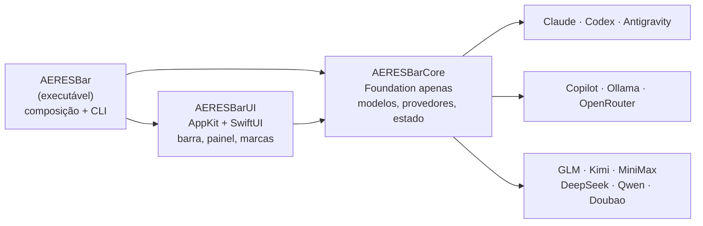

<p align="center">
  
</p>

<h1 align="center">AERES Bar</h1>

<p align="center">
  Consumo, limites e renovação do <b>Claude Code</b>, do <b>Codex</b>, do <b>Antigravity</b>, do <b>GitHub Copilot</b>, do <b>Ollama</b>, do <b>OpenRouter</b> e dos modelos chineses (<b>GLM</b>, <b>Kimi</b>, <b>MiniMax</b>, <b>DeepSeek</b>, <b>Qwen</b> e <b>Doubao</b>) num só item da barra de menus do macOS.
</p>

<p align="center">
  <a href="https://github.com/aeresdigital/aeres-bar/actions/workflows/ci.yml"></a>
  
  
  <a href="LICENSE"></a>
</p>

<p align="center">
  
</p>

<table align="center">
  <tr>
    <td></td>
    <td></td>
  </tr>
</table>

<p align="center"><sub>Imagens geradas com dados de exemplo (<code>make docs-images</code>).</sub></p>

---

## Sumário

- [Funcionalidades](#funcionalidades)
- [Requisitos](#requisitos)
- [Instalação](#instalação)
- [Atualizações](#atualizações)
- [Como usar](#como-usar)
- [Chaves de API](#chaves-de-api)
- [Modelos chineses](#modelos-chineses)
- [De onde vêm os números](#de-onde-vêm-os-números)
- [Privacidade e segurança](#privacidade-e-segurança)
- [Solução de problemas](#solução-de-problemas)
- [Desenvolvimento](#desenvolvimento)
- [CI/CD e releases](#cicd-e-releases)
- [Marcas](#marcas)
- [Licença](#licença)

## Funcionalidades

- **Um só item na barra de menus**, para ocupar pouco espaço: um medidor com uma barra por provedor, cheia até o uso de cada um, e ao lado a porcentagem do provedor mais perto do limite. Dá para trocar o medidor pelo logo do provedor mais crítico ou esconder o número e deixar só o ícone.
- **Número configurável:** limite mais crítico (padrão), janela principal, semanal ou tokens de hoje (somados); em % usada ou restante; com contagem regressiva opcional (`74% · 3d12h`).
- **Alertas visuais:** o número fica laranja a partir de 80% e vermelho a partir de 95%.
- **Painel ao passar o mouse** com todos os provedores de uma vez:
  - no topo, um **resumo em anéis no estilo do Apple Watch**: um anel por provedor, com o logo no centro e a porcentagem embaixo, verde até 79%, laranja a partir de 80% e vermelho a partir de 95%;
  - abaixo, cada janela de limite numa linha, com barra de progresso, % usado e quanto falta para renovar;
  - clicar num anel ou num provedor abre os detalhes: quando renova (`Renova em 1h 17min · hoje às 05:10`), tokens da sessão, do dia e da semana (entrada, saída, cache lido e gravado, respostas), plano, uso extra, uso semanal por produto, cota por modelo, gasto e saldo.
- **Treze provedores:** Claude Code, Codex, Antigravity, GitHub Copilot, Ollama (Cloud e servidor local), OpenRouter e os chineses GLM (Z.ai), Kimi Code, Kimi API, MiniMax, DeepSeek, Qwen e Doubao. Cada um pode ser desligado no menu; os que não estão configurados aparecem no rodapé do painel, com um atalho para configurar.
- **Clique** fixa o painel (fecha com clique fora ou Esc). **Clique direito** abre os ajustes.
- **Atualização automática** a cada 1–10 min, ao acordar o Mac e quando o Antigravity abre ou fecha. **Atualizar agora** (no painel ou no menu) consulta as APIs na hora. Um dado já lido nunca some: sem conexão ou com a ferramenta fechada, o painel mostra a última leitura e zera as janelas cujo horário de renovação já passou.
- **Abre com o macOS** (dá para desligar no menu).
- **Atualiza pelo próprio app:** cada versão publicada aparece no painel e no menu em até uma hora; um clique baixa, confere a assinatura e instala, e o app abre de novo em segundos (veja [Atualizações](#atualizações)).
- **Leve:** praticamente 0% de CPU em repouso e cerca de 25 MB de memória com o painel fechado. A leitura dos logs é incremental: a primeira passada pelos logs dos últimos 8 dias leva alguns segundos em segundo plano (1,8 GB em ~5 s num Mac com Apple Silicon); as seguintes leem só os bytes novos, em ~0,1 s.

## Requisitos

- macOS 14 Sonoma ou mais recente (Apple Silicon ou Intel).
- As ferramentas que você quer acompanhar, instaladas e com login:
  - [Claude Code](https://claude.com/claude-code), [Codex CLI](https://github.com/openai/codex) (login com ChatGPT) e/ou [Antigravity](https://antigravity.google);
  - GitHub Copilot: o login do [GitHub CLI](https://cli.github.com) (`gh auth login`) ou de um plugin do Copilot para Vim, Neovim, JetBrains ou Xcode;
  - Ollama e OpenRouter: uma chave de API (veja [Chaves de API](#chaves-de-api)). Sem chave, o Ollama mostra só o servidor local;
  - modelos chineses: uma chave de API ou o login da ferramenta oficial, conforme o provedor (veja [Modelos chineses](#modelos-chineses)).
- Para compilar: Xcode 26 ou mais recente (o CI compila com o Xcode 26.6 e o Swift 6.3).

## Instalação

As versões ficam no repositório público [aeresdigital/aeres-bar-releases](https://github.com/aeresdigital/aeres-bar-releases/releases), que tem só os instaladores (o código-fonte continua privado).

### Pelo Terminal (recomendado)

```bash
curl -fsSL https://github.com/aeresdigital/aeres-bar-releases/releases/latest/download/install.sh | sh
```

O instalador baixa a versão mais recente, confere o checksum e a assinatura de código, instala em `/Applications` (substituindo uma versão anterior, mesmo que tenha outro nome) e abre o app. Baixado assim, o app não recebe a marca de quarentena que o navegador coloca: abre sem o aviso "Apple could not verify…" e as próximas versões chegam pelo próprio app. Preferências, chaves de API e cache ficam como estão.

### Pelo DMG

1. Baixe o `AERES-Bar.dmg` da [versão mais recente](https://github.com/aeresdigital/aeres-bar-releases/releases/latest) (o `.sha256` fica ao lado).
2. Abra o DMG e arraste o **AERES Bar** para **Aplicativos**.
3. Abra o app. Sem assinatura Developer ID, o macOS bloqueia a primeira abertura. No macOS 15 ou mais recente, vá em **Ajustes do Sistema › Privacidade e Segurança** e clique em **Abrir Mesmo Assim**; no macOS 14, clique com o botão direito no app › **Abrir**.

Instalado pelo navegador, o app pode ficar protegido pelo macOS contra alterações, e aí não consegue se atualizar sozinho. Quando isso acontece, o próprio app avisa e mostra o comando do Terminal acima: basta rodá-lo uma vez.

### Pelo código-fonte

```bash
git clone https://github.com/aeresdigital/aeres-bar.git
cd aeres-bar
make install
```

O repositório é privado: o `git clone` pede uma conta com acesso. `make install` compila em modo release, instala em `/Applications/AERES Bar.app` (substituindo uma versão anterior) e abre o app.

### Desinstalar

```bash
make uninstall
```

Desliga a abertura no login, encerra o app e apaga o app, o cache, as preferências e as chaves de API que ele guardou no Chaves.

## Atualizações

Cada merge na `main` que muda o app vira uma versão publicada em alguns minutos (veja [CI/CD e releases](#cicd-e-releases)), e os apps instalados a recebem sozinhos:

- **Quando o app procura:** ao abrir, a cada hora e em **Ajustes › Procurar atualizações…**. Ele lê o `update.json` da versão mais recente em [aeres-bar-releases](https://github.com/aeresdigital/aeres-bar-releases/releases/latest).
- **Como aparece:** no topo do painel (**Nova versão disponível**, com a primeira novidade) e no início do menu (**Instalar a versão 1.0.N…**). Nada abre sozinho por cima do que você está fazendo; **Agora não** deixa a oferta para a próxima vez que o app abrir.
- **O que acontece ao instalar:** o app baixa o zip da versão, confere a assinatura Ed25519 com a chave pública embutida nele, descompacta ao lado do app instalado, confere o identificador, o número do build e a assinatura de código, fecha e deixa um ajudante trocar os apps e abrir o novo. Se a troca falhar, a versão anterior volta e o app avisa na abertura seguinte.
- **Pelo Terminal:** `"/Applications/AERES Bar.app/Contents/MacOS/AERESBar" --check-update` compara a versão instalada com a publicada, e o comando de [instalação](#pelo-terminal-recomendado) reinstala a mais recente a qualquer momento.

## Como usar

| Gesto | Resultado |
| --- | --- |
| Passar o mouse sobre o item | Abre o painel com todos os provedores |
| Clicar num anel ou num provedor no painel | Abre ou fecha os detalhes dele |
| Clique no item | Fixa o painel; clique fora ou Esc fecha |
| Clique direito (ou ⌃-clique) | Menu de ajustes |
| ⌘-arrastar o item | Muda a posição dele na barra (posição salva) |

**Ajustes** (clique direito, ou ⚙︎ no topo do painel):

- **Provedores:** liga ou desliga cada provedor. Desligado, ele não é consultado nem aparece. O último não pode ser desligado.
- **Chaves de API:** define, troca ou remove as chaves (OpenRouter, Ollama Cloud, GLM, Kimi Code, Kimi API, MiniMax e DeepSeek) e abre a página onde criá-las.
- **Ícone na barra:** medidores de todos os provedores (padrão) ou o logo do provedor mais crítico.
- **Número na barra:** limite mais crítico, janela principal, limite semanal ou tokens de hoje.
- **Mostrar o número ao lado do ícone** (desligado, fica só o ícone), **Mostrar % restante**, **Mostrar tempo até renovar** e **Cores de alerta**.
- **Atualizar a cada:** 1, 2 (padrão), 5 ou 10 minutos.
- **Abrir ao iniciar o macOS.**
- **Procurar atualizações…** e, quando há uma versão nova, **Instalar a versão 1.0.N…** no topo do menu.

## Chaves de API

Os serviços que não deixam um login no Mac para o app reaproveitar pedem uma chave:

| Serviço | Onde criar | Observação |
| --- | --- | --- |
| OpenRouter | [openrouter.ai/settings/keys](https://openrouter.ai/settings/keys) | Qualquer chave (`sk-or-v1-…`). Com uma chave de gerenciamento, o painel também mostra o saldo de créditos |
| Ollama Cloud | [ollama.com/settings/keys](https://ollama.com/settings/keys) | Chave da API da sua conta |
| GLM (Z.ai) | [z.ai/manage-apikey/apikey-list](https://z.ai/manage-apikey/apikey-list) (China: bigmodel.cn) | Chave de uma conta com GLM Coding Plan |
| Kimi Code | [kimi.ai/code/console](https://www.kimi.ai/code/console) (China: kimi.com) | Dispensável se o Kimi Code CLI estiver logado |
| Kimi API | [platform.kimi.ai/console/api-keys](https://platform.kimi.ai/console/api-keys) (China: platform.kimi.com) | Chave da plataforma aberta (antiga Moonshot) |
| MiniMax | [platform.minimax.io › Token Plan](https://platform.minimax.io/user-center/payment/token-plan) (China: platform.minimax.cn) | A *Subscription Key* (`sk-cp-…`); a de pagamento por uso não lê o plano |
| DeepSeek | [platform.deepseek.com/api_keys](https://platform.deepseek.com/api_keys) | Qualquer chave da conta |

Para guardar a chave, use **Ajustes › Chaves de API › Definir a chave…** e cole-a no campo protegido. Pelo Terminal, o app pede a chave sem mostrá-la na tela:

```bash
"/Applications/AERES Bar.app/Contents/MacOS/AERESBar" --set-key openrouter
```

As contas aceitas são `openrouter`, `ollama`, `glm`, `kimi-code`, `moonshot` (Kimi API), `minimax` e `deepseek`. Também dá para passar a chave por um pipe, por exemplo `pbpaste | "/Applications/AERES Bar.app/Contents/MacOS/AERESBar" --set-key deepseek`, e apagar com `--delete-key <conta>`. Sem chave guardada, o app usa as variáveis de ambiente das próprias ferramentas (`OPENROUTER_API_KEY`, `OLLAMA_API_KEY`, `ZAI_API_KEY`, `MOONSHOT_API_KEY`, `MINIMAX_API_KEY`, `DEEPSEEK_API_KEY`…), se existirem no ambiente dele.

## Modelos chineses

Cada plataforma chinesa expõe o uso de um jeito. O AERES Bar usa, em cada uma, a fonte mais confiável que existe:

| Provedor | O que aparece | Como o app lê | Credencial usada |
| --- | --- | --- | --- |
| **GLM (Z.ai / Zhipu)** | GLM Coding Plan: sessão de 5 h e semana (em créditos ou tokens) e a cota mensal de ferramentas MCP | `GET /api/monitor/usage/quota/limit` em `api.z.ai` ou `open.bigmodel.cn`, o mesmo do plugin oficial de uso | A chave guardada; a do Claude Code configurado para o GLM; ou a do Coding Tool Helper (`~/.chelper`) |
| **Kimi Code** | Assinatura do Kimi Code: sessão de 5 h, semana (planos antigos) e mês | `GET /coding/v1/usages` em `api.kimi.ai` ou `api.kimi.com`, o mesmo do `/usage` do Kimi Code CLI | O login do Kimi Code CLI (`~/.kimi-code`); a chave guardada; ou o Claude Code configurado para o Kimi |
| **Kimi API** | Saldo da plataforma aberta, em dólar (internacional) ou yuan (China) | `GET /v1/users/me/balance` em `api.moonshot.ai` ou `api.moonshot.cn` | A chave guardada, ou a do Claude Code configurado para a plataforma |
| **MiniMax** | Token Plan: sessão de 5 h e semana | `GET /v1/token_plan/remains` em `api.minimax.io` ou `api.minimaxi.com` | A chave guardada; a do Claude Code configurado para o MiniMax; ou a do CLI oficial (`~/.mmx`) |
| **DeepSeek** | Saldo, com a parte recarregada e a de bônus | `GET /user/balance`, o único endpoint de conta da API | A chave guardada; ou a do Claude Code ou do Codex configurados para o DeepSeek |
| **Qwen (Model Studio)** | Coding Plan: sessão de 5 h, semana e mês de cobrança | CLI oficial do Model Studio: `bl usage coding-plan` | O login do `bl` (`npm install -g bailian-cli` e `bl auth login --console`) |
| **Doubao (Volcengine)** | Coding Plan e Agent Plan: sessão, semana e mês | CLI oficial do Volcengine: `arkcli usage plan` | O login do `arkcli` (`npm i -g @volcengine/ark-cli` e `arkcli auth login`) |

O que vale saber:

- **Região detectada sozinha.** As chaves dessas plataformas só valem na região que as emitiu (internacional ou China continental). O app tenta as duas e passa a usar a que aceitou a chave.
- **Logins que você já configurou.** Quem usa GLM, Kimi, MiniMax ou DeepSeek pelo Claude Code tem a chave em `~/.claude/settings.json`; o app a lê só quando o `ANTHROPIC_BASE_URL` de lá aponta para aquele provedor, e a chave só vai para ele. Os logins dos CLIs oficiais também são lidos, nunca renovados: quando vencem, o painel pede para usar a ferramenta uma vez.
- **Endpoints sem documentação pública.** Os do GLM e do Kimi Code vêm do código das ferramentas oficiais e já mudaram de formato; o app aceita as variações conhecidas (por exemplo, no Kimi Code, vale o maior entre a razão e as contagens, porque o servidor às vezes informa 0% com a cota esgotada).
- **DeepSeek e Kimi API mostram saldo, não limites:** não têm janelas de uso, então aparecem no painel mas não nos anéis nem no medidor.
- **Qwen e Doubao pelos CLIs oficiais.** O Coding Plan do Model Studio não tem API que aceite a chave dele, e a chave do Ark (a que o Claude Code usa) não lê o uso do plano. O app não pede a AccessKey/SecretKey da conta, que dá acesso a tudo: roda o CLI de cada fornecedor, que tem o próprio login, e só se a pasta de login dele existir. O plano gratuito do Qwen Code (login Qwen OAuth) acabou em 2026-04-15.
- **Fora, por enquanto: SiliconFlow.** A API de saldo foi desligada na China em 2026-08-14 e, no site internacional, voltou a informar saldos zerados.

## De onde vêm os números

| Provedor | Limites e horários de renovação | Tokens e extras |
| --- | --- | --- |
| **Claude Code** | API de uso da Anthropic (`GET /api/oauth/usage`, a mesma do `/usage`), com o login que o Claude Code guarda no Chaves (item *Claude Code-credentials*) ou em `~/.claude/.credentials.json` | Transcrições em `~/.claude/projects/**/*.jsonl` (respeita `CLAUDE_CONFIG_DIR`) |
| **Codex** | API do ChatGPT (`GET /backend-api/wham/usage`) com o login de `~/.codex/auth.json`; se ela falhar, o último `rate_limits` gravado pelo CLI | Rollouts em `~/.codex/sessions/**/rollout-*.jsonl` (respeita `CODEX_HOME`) |
| **Antigravity** | Language server local do Antigravity (`GetUserStatus` e `RetrieveUserQuotaSummary` em `127.0.0.1`) | O Antigravity não expõe contagem de tokens |
| **GitHub Copilot** | API do GitHub (`GET /copilot_internal/user`, a mesma das extensões do Copilot): requisições premium, chat e autocompletar do mês, com o login do `gh` (`gh auth token`, `hosts.yml`), dos plugins do Copilot (`~/.config/github-copilot`) ou `GH_TOKEN`/`GITHUB_TOKEN` | O Copilot não expõe contagem de tokens |
| **Ollama** | API do Ollama Cloud (`GET https://ollama.com/api/usage`): sessão de 5 h e semanal, com a chave da API | Servidor local (`/api/version`, `/api/ps`, respeita `OLLAMA_HOST`): versão e modelos carregados. Modelos locais não têm limite |
| **OpenRouter** | API do OpenRouter (`GET /api/v1/key`): limite de gasto da chave (diário, semanal, mensal ou fixo) e cota diária de modelos gratuitos | Gasto do dia, da semana e do mês; saldo de créditos (`/api/v1/credits`) com chave de gerenciamento |
| **Modelos chineses** | Veja [Modelos chineses](#modelos-chineses) | Saldo do DeepSeek e da Kimi API; parte do Kimi Code na cota mensal do Kimi; chamadas de ferramentas MCP do GLM |

Detalhes que valem saber:

- **As porcentagens vêm dos provedores** e incluem o uso em qualquer dispositivo, como o app e a web. **Os tokens vêm dos logs deste Mac** e contam apenas o que rodou aqui. As respostas são deduplicadas: o Claude Code grava a mesma resposta uma vez por bloco de conteúdo, e o Codex repete eventos `token_count`.
- **Janela "começa no próximo uso":** o Codex e o Antigravity informam janelas ainda não usadas com uma renovação que anda junto com o relógio. Nesse caso o painel diz isso em vez de mostrar uma contagem regressiva falsa.
- **Horários de renovação:** o Copilot renova no primeiro dia do mês; o OpenRouter, à meia-noite UTC (semanas de segunda a domingo); as plataformas chinesas informam o horário exato, e as semanas delas viram na segunda-feira à meia-noite de Pequim. O Ollama Cloud não informa quando as janelas renovam, então o painel mostra só o uso.
- **Consulta gentil às APIs:** nas atualizações automáticas, uma resposta recente é reaproveitada (3 min na Anthropic, cujo limite de requisições é apertado, e 1 min nas demais), então passar o mouse não gera uma chamada. **Atualizar agora** consulta na hora, mas não mais que uma vez a cada 15 s. Um HTTP 429 respeita o `Retry-After`, entre 30 s e 30 min, ou pausa 5 min, inclusive para o botão.
- **O Antigravity só responde enquanto está aberto.** O AERES Bar localiza o processo `language_server` (`ps`), a porta em escuta (`lsof`) e o token CSRF da linha de comando do processo.
- **Credenciais expiradas não são renovadas pelo app.** Isso é de propósito: renovar um OAuth rotaciona o *refresh token* e poderia deslogar o Claude Code ou o Codex. Quando você volta a usar a ferramenta, ela renova sozinha e o AERES Bar volta a ler.

## Privacidade e segurança

- Tudo roda localmente. O app não envia telemetria nem tem servidor próprio.
- Para as atualizações, o app só baixa arquivos públicos do GitHub (`github.com` e o servidor de downloads para onde ele redireciona): o `update.json` e, quando você instala, o zip da versão. O pedido não leva nada seu além da versão do app no `User-Agent`, e nada é instalado sem a assinatura conferir (veja [Atualizações](#atualizações)).
- Cada credencial só vai para o servidor oficial do seu provedor, por HTTPS: `api.anthropic.com`, `chatgpt.com`, `api.github.com`, `ollama.com`, `openrouter.ai`, `api.z.ai` / `open.bigmodel.cn`, `api.kimi.ai` / `api.kimi.com`, `api.moonshot.ai` / `api.moonshot.cn`, `api.minimax.io` / `api.minimaxi.com` e `api.deepseek.com`. O app nunca a grava em arquivos, no cache ou nos logs.
- Chaves e logins que outras ferramentas já guardam (Claude Code, Codex, Kimi Code CLI, MiniMax CLI, Coding Tool Helper do Z.ai) são só lidos. O Qwen e o Doubao são lidos rodando os CLIs oficiais (`bl`, `arkcli`), apenas se a pasta de login deles existir.
- As chaves de API ficam só no Chaves do macOS (serviço *AERES Bar*). São gravadas pelo `/usr/bin/security` com a chave enviada pela entrada padrão, nunca como argumento de linha de comando, que outros processos poderiam listar.
- O cache (`~/Library/Application Support/AERES Bar/snapshots.json`) guarda só números, datas e textos exibidos.
- O certificado autoassinado do Antigravity é aceito **apenas** para `127.0.0.1`, `localhost` e `::1`.
- A leitura do Chaves usa `/usr/bin/security`, a mesma ferramenta com que o Claude Code grava o item, por isso não aparece pedido de senha.

Veja também [SECURITY.md](SECURITY.md).

## Solução de problemas

| Sintoma | O que fazer |
| --- | --- |
| O item não aparece na barra | Em MacBooks com notch, itens podem ficar escondidos atrás dele; esconda outros itens ou use ⌘-arrastar. No macOS 26 ou mais recente, confira **Ajustes do Sistema › Barra de Menus** |
| Claude: "A credencial do Claude Code expirou" | Use o Claude Code uma vez (qualquer comando); ele renova o login e o AERES Bar volta a ler na próxima atualização |
| "pediu uma pausa nas consultas" | Limite de requisições do provedor; o app espera sozinho o tempo pedido |
| Antigravity: "está fechado" | Abra o Antigravity; o painel tem um botão para isso e atualiza sozinho em seguida |
| Codex: "sem login com o ChatGPT" | Rode `codex login` |
| Copilot: "Nenhum login do GitHub encontrado" | Instale o GitHub CLI e rode `gh auth login` |
| Copilot: "Esta conta do GitHub não tem o Copilot ativo" | Ative o Copilot (há um plano gratuito) em github.com/settings/copilot |
| Ollama: "O servidor do Ollama está parado" | Abra o Ollama, ou defina a chave do Ollama Cloud para ver os limites da nuvem |
| "A chave do … foi recusada" | Confira se a chave é do tipo certo (no MiniMax, a *Subscription Key*). Se preciso, crie outra e use **Ajustes › Chaves de API › Trocar a chave…** |
| GLM: "Esta chave não tem um GLM Coding Plan ativo" | A chave é de uma conta sem Coding Plan: use a da conta que tem a assinatura |
| Kimi Code: "O login do Kimi Code expirou" | Use o Kimi Code CLI uma vez (ou rode `/login` nele) |
| Qwen ou Doubao: "Rode … auth login" | Instale o CLI oficial (`bl` ou `arkcli`) e entre nele pelo Terminal |
| "Apple could not verify…" ao abrir | Instale pelo Terminal (`curl -fsSL https://github.com/aeresdigital/aeres-bar-releases/releases/latest/download/install.sh | sh`) ou use **Abrir Mesmo Assim** em **Ajustes do Sistema › Privacidade e Segurança** |
| "O macOS protege o AERES Bar…" ao atualizar | O app veio de um download pelo navegador. Rode uma vez o comando de instalação pelo Terminal (o aviso tem um botão para copiá-lo); depois as atualizações chegam sozinhas |
| Números estranhos | Rode o diagnóstico abaixo e abra uma issue com a saída (sem e-mails) |

Diagnóstico e logs:

```bash
# Tudo o que o app lê, em JSON (não mostra tokens nem chaves)
"/Applications/AERES Bar.app/Contents/MacOS/AERESBar" --dump

# Logs em tempo real (/usr/bin/log: no zsh, "log" sozinho é outro comando)
/usr/bin/log stream --predicate 'subsystem == "com.aeresdigital.aeresbar"'

# Estado da abertura no login
"/Applications/AERES Bar.app/Contents/MacOS/AERESBar" --login-item status

# Versão instalada e a mais recente publicada
"/Applications/AERES Bar.app/Contents/MacOS/AERESBar" --check-update
```

## Desenvolvimento

### Ambiente

- Xcode 26 ou mais recente (Swift 6.3 no CI), com o modo de linguagem Swift 6 e checagem estrita de concorrência.
- Sem dependências em tempo de execução. O `swift-format` fica fixado numa versão exata no pacote separado [`BuildTools`](BuildTools/Package.swift), para que o lint local e o do CI sejam idênticos.

### Comandos

| Comando | O que faz |
| --- | --- |
| `make check` | Tudo o que o CI verifica: lint, build sem avisos e testes com cobertura mínima |
| `make build` | Compila em debug tratando avisos como erros |
| `make test` | Roda os testes |
| `make coverage` | Testes com cobertura por módulo e verificação dos mínimos (gera `.build/coverage/coverage.lcov`) |
| `make format` / `make lint` | Formata / verifica o estilo com o `swift-format` fixado |
| `make run` | Roda o app a partir do código |
| `make app` | Gera `dist/AERES Bar.app`, versão `MAJOR.MINOR` de `VERSION` + número do build (`UNIVERSAL=1` para arm64 + x86_64) |
| `make dmg` | Gera `dist/AERES-Bar.dmg` e o `.sha256` |
| `make install` / `make uninstall` | Instala em / remove de `/Applications` |
| `make dump` | Mostra em JSON o que o app lê na sua máquina |
| `make preview` / `make docs-images` | Imagens do painel com seus dados / com dados de exemplo (README) |
| `make icon` | Regera `Resources/AppIcon.icns` |

### Arquitetura

Três módulos com dependências numa só direção. Detalhes e decisões em [docs/ARCHITECTURE.md](docs/ARCHITECTURE.md).



- **AERESBarCore** não importa AppKit. Tem os modelos, os parsers das APIs, os leitores incrementais de log, os provedores (um `actor` cada), o `UsageStore` (`@Observable`, fonte única de verdade), as preferências e os textos exibidos (`BarPresenter`, `UsagePresentation`), todos testáveis.
- Tudo que toca o mundo externo fica atrás de um protocolo injetável: `HTTPClient`, `CommandRunner` (`ps`, `lsof`, `security`, `gh`), `ClaudeCredentialSource`, `GitHubTokenSource`, `SecretStore`, `SnapshotPersisting` e relógio. Os testes rodam sem rede, sem Chaves e sem as ferramentas instaladas.
- **Atualização** (`AERESBarCore/Update`): `UpdateFeed` lê o `update.json` e baixa o zip, `UpdateSignature` confere a assinatura Ed25519, `BundleUpdateInstaller` descompacta, confere e deixa o ajudante trocar os apps, e o `AppUpdater` (`@Observable`) guarda o estado que o painel e o menu mostram.
- **AERESBarUI** tem o item da barra (`NSStatusItem` com o medidor desenhado como imagem-modelo), o painel flutuante não ativante (SwiftUI sobre Liquid Glass no macOS 26+), o menu de ajustes e as marcas oficiais, vetoriais a partir do SVG de cada fornecedor.

### Testes

- **Swift Testing**, com mais de 250 testes: parsers com fixtures das respostas reais anonimizadas, leitores de log com arquivos temporários (incluindo linhas parciais e truncamento), provedores com HTTP, processos, credenciais, chaves e relógio falsos (401, 403, 429 com `Retry-After`, credencial expirada, troca e remoção de chave, fallback para logs, Antigravity fechado, servidor do Ollama parado, troca de região, erro no corpo de respostas 200, CLIs oficiais sem login), store, persistência, preferências, gravação de chaves pela entrada padrão, atualização (manifesto, feed, assinatura Ed25519, instalação com `ditto` e `codesign` de verdade, troca dos apps pelo ajudante e volta da versão anterior, estados do atualizador), parser SVG, renderização das marcas, do medidor, do painel e do aviso de atualização, e o menu de ajustes.
- Cobertura mínima verificada no CI: **85% em `AERESBarCore`** (hoje ~94%) e **60% em `AERESBarUI`**. A cola com AppKit (item da barra, janela, `SMAppService`) precisa de sessão gráfica e é verificada manualmente.

### Convenções

- Commits no padrão [Conventional Commits](https://www.conventionalcommits.org/pt-br/) (`feat:`, `fix:`, `docs:`, `ci:`…).
- Textos da interface em português; código, identificadores e comentários em inglês.
- Veja [CONTRIBUTING.md](CONTRIBUTING.md).

## CI/CD e releases

| Workflow | Quando | O que faz |
| --- | --- | --- |
| [`ci.yml`](.github/workflows/ci.yml) | PRs e push na `main` | **Lint** no Linux (`swift:6.4`, barato) e um job **macOS** que compila com avisos como erros, roda os testes com cobertura, aplica os mínimos e publica o lcov |
| [`release.yml`](.github/workflows/release.yml) | Push na `main` que muda o app, ou à mão | Testa, gera o app universal, o DMG e o zip assinado com o `update.json`, e publica a versão aqui (tag no commit) e em [aeres-bar-releases](https://github.com/aeresdigital/aeres-bar-releases/releases), de onde as pessoas instalam e os apps se atualizam |
| [Dependabot](.github/dependabot.yml) | Semanal / mensal | Atualiza as actions e o `swift-format` fixado |

Em repositório privado, os minutos de runners macOS são cobrados com multiplicador. Por isso o lint roda em Linux, o CI tem um único job macOS e a release só roda quando algo do app muda (documentação, testes e configurações do repositório não geram versão).

### Versões

- **Não há etapa manual:** o merge de um PR que muda o app publica a versão em alguns minutos, e os apps instalados a oferecem em até uma hora.
- **Número:** `MAJOR.MINOR` do arquivo [`VERSION`](VERSION) mais o número do build, que é a quantidade de commits na `main` (`1.0.23`). Ele só cresce, porque a `main` não aceita *force push*, e é o que o app compara para saber se há versão nova. Para abrir a série 1.1, mude `VERSION` para `1.1` no PR.
- **Notas:** geradas das mensagens de commit desde a versão anterior ([`scripts/release_notes.sh`](scripts/release_notes.sh)): `feat:` vira **Novidades**, `fix:` vira **Correções** e `perf:` vira **Melhorias**; o resto fica de fora. Escreva a mensagem pensando em quem usa o app.
- **Rodar de novo ou sem publicar:** **Actions › Release › Run workflow**. Com **Publicar** desligado (ou fora da `main`), só gera os arquivos e os guarda como artefato por 14 dias.
- **Local:** `make app` e `make dmg` geram o mesmo app e o mesmo DMG; `scripts/release_notes.sh` mostra as notas que a próxima versão teria.

### Segredos

| Segredo | Para quê | Situação |
| --- | --- | --- |
| `UPDATE_SIGNING_KEY` | Chave privada Ed25519 que assina o zip de cada versão. A pública está em `UpdateFeed.publicKey` | Configurado |
| `RELEASES_TOKEN` | Token *fine-grained* com **Contents: Read and write** só em `aeresdigital/aeres-bar-releases`, para publicar lá | Criar (veja abaixo) |
| `MACOS_CERTIFICATE`, `MACOS_CERTIFICATE_PASSWORD` | Certificado *Developer ID Application* (.p12 em base64) e a senha | Opcional |
| `NOTARY_KEY_ID`, `NOTARY_ISSUER_ID`, `NOTARY_KEY` | Chave da App Store Connect API (o `.p8`) para notarizar | Opcional |

Sem `UPDATE_SIGNING_KEY` ou `RELEASES_TOKEN`, a versão sai só neste repositório e os apps instalados não a recebem. Sem os opcionais, o app sai com assinatura ad-hoc e o macOS pede confirmação na primeira abertura pelo DMG; com eles, sai assinado com Developer ID, notarizado e grampeado.

Para criar o `RELEASES_TOKEN`: em [github.com/settings/personal-access-tokens/new](https://github.com/settings/personal-access-tokens/new), escolha **Resource owner: aeresdigital**, **Only select repositories › aeres-bar-releases** e **Repository permissions › Contents: Read and write**; depois:

```bash
gh secret set RELEASES_TOKEN -R aeresdigital/aeres-bar
```

A chave de assinatura não pode ser lida de volta do GitHub: guarde uma cópia fora dele. Trocar a chave exige publicar uma versão com a chave pública nova e faz os apps já instalados pararem de aceitar atualizações até serem reinstalados pelo Terminal.

## Marcas

Claude e Anthropic são marcas da Anthropic, PBC. OpenAI, ChatGPT e Codex são marcas da OpenAI. Google e Antigravity são marcas da Google LLC. GitHub e GitHub Copilot são marcas da GitHub, Inc. Ollama é marca da Ollama, Inc. OpenRouter é marca da OpenRouter, Inc. GLM, Z.ai e Zhipu são marcas da Zhipu AI; Kimi e Moonshot, da Moonshot AI; MiniMax, da MiniMax; DeepSeek, da DeepSeek; Qwen e Model Studio, do Alibaba Group; Doubao e Volcengine, da ByteDance. As marcas aparecem só para identificar cada serviço. As do Claude, do Codex e do Antigravity foram extraídas dos arquivos que os próprios fornecedores distribuem; a do Copilot vem dos [Octicons](https://github.com/primer/octicons) do GitHub; as do Ollama e do OpenRouter, do [Simple Icons](https://simpleicons.org); as das plataformas chinesas, do [lobe-icons](https://github.com/lobehub/lobe-icons) (MIT). O AERES Bar não é afiliado a nenhuma dessas empresas.

## Licença

O AERES Bar é distribuído sob a [PolyForm Noncommercial License 1.0.0](LICENSE). © 2026 AERES Digital.

Em resumo (o texto em inglês da licença é o que vale):

- **Pode:** usar, copiar e distribuir o app para qualquer fim não comercial, como uso pessoal, estudo, pesquisa, hobby, ou por instituições de ensino, organizações sem fins lucrativos e órgãos públicos.
- **Não pode:** usar para fins comerciais, o que inclui usar o app a serviço de uma empresa, vendê-lo ou incluí-lo num produto ou serviço pago, sem uma licença comercial da AERES Digital.
- **Ao repassar:** mantenha a licença e a linha `Required Notice` junto com o app (o app já leva as duas em `Contents/Resources/LICENSE`).

Para uso comercial, fale com a AERES Digital em [aeres.com.br](https://www.aeres.com.br). Os desenhos das marcas de terceiros seguem as licenças listadas em [THIRD-PARTY-NOTICES.md](THIRD-PARTY-NOTICES.md).
