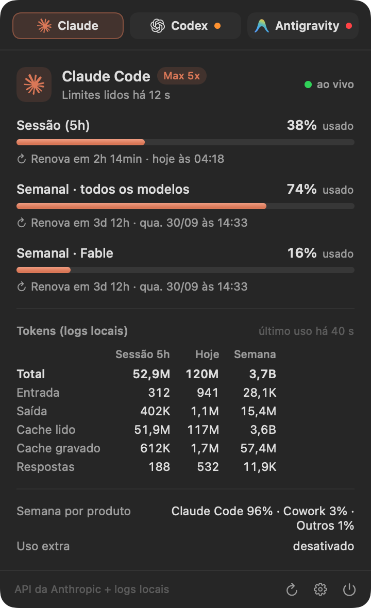
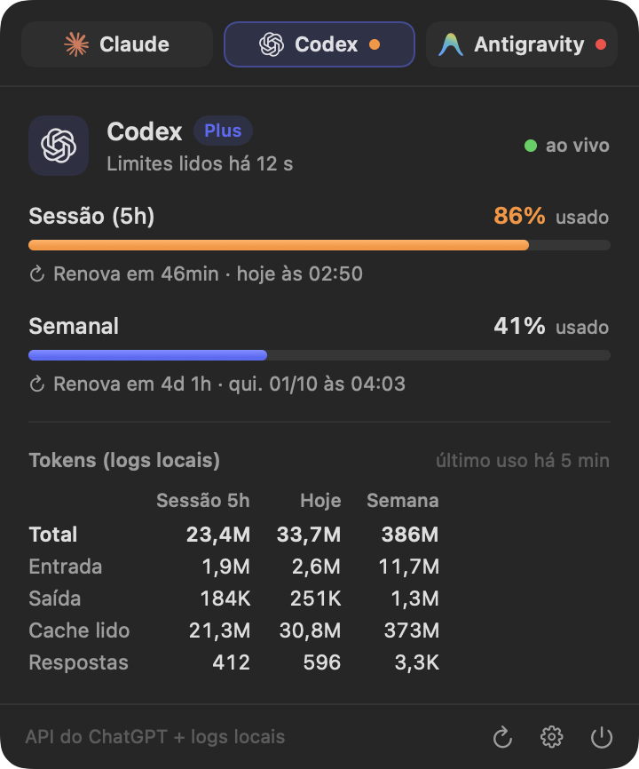
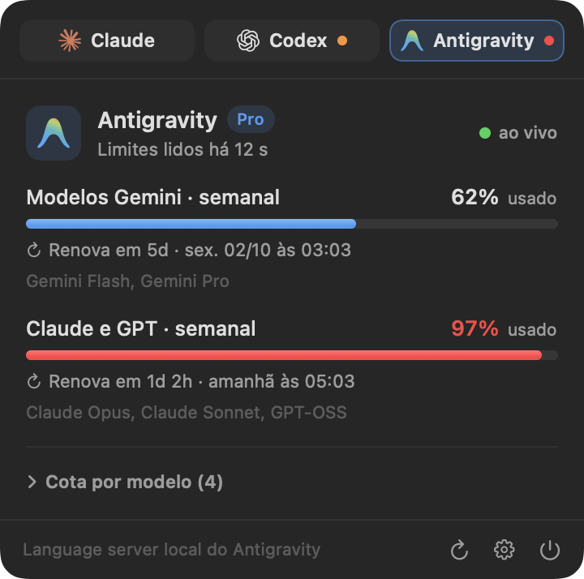
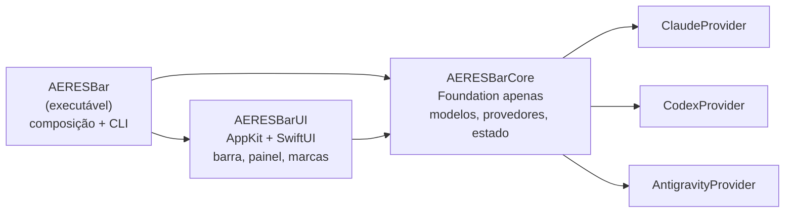

<p align="center">
  
</p>

<h1 align="center">AERES Bar</h1>

<p align="center">
  Consumo, limites e renovação do <b>Claude Code</b>, do <b>Codex</b> e do <b>Antigravity</b> na barra de menus do macOS.
</p>

<p align="center">
  <a href="https://github.com/aeresdigital/aeres-bar/actions/workflows/ci.yml"></a>
  
  
  
</p>

<p align="center">
  
</p>

<table align="center">
  <tr>
    <td></td>
    <td></td>
    <td></td>
  </tr>
</table>

<p align="center"><sub>Imagens geradas com dados de exemplo (<code>make docs-images</code>).</sub></p>

---

## Sumário

- [Funcionalidades](#funcionalidades)
- [Requisitos](#requisitos)
- [Instalação](#instalação)
- [Como usar](#como-usar)
- [De onde vêm os números](#de-onde-vêm-os-números)
- [Privacidade e segurança](#privacidade-e-segurança)
- [Solução de problemas](#solução-de-problemas)
- [Desenvolvimento](#desenvolvimento)
- [CI/CD e releases](#cicd-e-releases)
- [Marcas](#marcas)
- [Licença](#licença)

## Funcionalidades

- **Um item por provedor na barra de menus**, com a marca oficial de cada serviço em versão monocromática (como os ícones do sistema) e a porcentagem ao lado.
- **Número configurável:** limite mais crítico (padrão), janela principal, semanal ou tokens de hoje; em % usada ou restante; com contagem regressiva opcional (`74% · 3d12h`).
- **Alertas visuais:** o número fica laranja a partir de 80% e vermelho a partir de 95%.
- **Painel ao passar o mouse**, com:
  - todas as janelas de limite (sessão de 5 h, semanal, semanal por modelo, cotas por grupo de modelos), cada uma com barra de progresso;
  - quanto falta para renovar e quando: `Renova em 1h 17min · hoje às 05:10`;
  - tokens gastos na sessão, hoje e na semana (entrada, saída, cache lido e gravado, respostas);
  - plano da conta, uso extra, divisão do uso semanal por produto e cota por modelo.
- **Clique** fixa o painel (fecha com clique fora ou Esc). **Clique direito** abre os ajustes.
- **Atualização automática** a cada 1–10 min, ao acordar o Mac e quando o Antigravity abre ou fecha. Um dado já lido nunca some: sem conexão ou com a ferramenta fechada, o painel mostra a última leitura e zera as janelas cujo horário de renovação já passou.
- **Abre com o macOS** (dá para desligar no menu).
- **Leve:** 0% de CPU em repouso e ~20 MB de memória. A leitura dos logs é incremental: após a primeira passada, só lê os bytes novos.

## Requisitos

- macOS 14 Sonoma ou mais recente (Apple Silicon ou Intel).
- As ferramentas que você quer acompanhar, instaladas e com login: [Claude Code](https://claude.com/claude-code), [Codex CLI](https://github.com/openai/codex) (login com ChatGPT) e/ou [Antigravity](https://antigravity.google).
- Para compilar: Xcode 16 ou mais recente (Swift 6).

## Instalação

### Pelo DMG

1. Baixe o `AERES-Bar-x.y.z.dmg` mais recente em [Releases](https://github.com/aeresdigital/aeres-bar/releases) e confira o `.sha256` se quiser.
2. Abra o DMG e arraste o **AERES Bar** para **Aplicativos**.
3. Abra o app. Se a release não tiver assinatura Developer ID, o macOS pede confirmação na primeira vez: clique com o botão direito no app › **Abrir**. Pelo Terminal, dá no mesmo:

   ```bash
   xattr -dr com.apple.quarantine "/Applications/AERES Bar.app"
   ```

### Pelo código-fonte

```bash
git clone https://github.com/aeresdigital/aeres-bar.git
cd aeres-bar
make install
```

`make install` compila em modo release, instala em `/Applications/AERES Bar.app` (substituindo uma versão anterior) e abre o app.

### Desinstalar

```bash
make uninstall
```

Desliga a abertura no login, encerra o app e apaga o app, o cache e as preferências.

## Como usar

| Gesto | Resultado |
| --- | --- |
| Passar o mouse sobre um item | Abre o painel daquele provedor; deslizar para os vizinhos troca de provedor |
| Clique | Fixa o painel; clique fora ou Esc fecha |
| Clique direito (ou ⌃-clique) | Menu de ajustes |
| ⌘-arrastar um item | Reordena os itens na barra (posição salva) |

**Ajustes** (clique direito, ou ⚙︎ no rodapé do painel):

- **Mostrar na barra:** escolha quais provedores aparecem. O último não pode ser escondido.
- **Número na barra:** limite mais crítico, janela principal, limite semanal ou tokens de hoje.
- **Mostrar % restante**, **Mostrar tempo até renovar** e **Cores de alerta**.
- **Atualizar a cada:** 1, 2 (padrão), 5 ou 10 minutos.
- **Abrir ao iniciar o macOS.**

## De onde vêm os números

| Provedor | Limites e horários de renovação | Tokens |
| --- | --- | --- |
| **Claude Code** | API de uso da Anthropic (`GET /api/oauth/usage`, a mesma do `/usage`), com o login que o Claude Code guarda no Chaves (item *Claude Code-credentials*) ou em `~/.claude/.credentials.json` | Transcrições em `~/.claude/projects/**/*.jsonl` (respeita `CLAUDE_CONFIG_DIR`) |
| **Codex** | API do ChatGPT (`GET /backend-api/wham/usage`) com o login de `~/.codex/auth.json`; se ela falhar, o último `rate_limits` gravado pelo CLI | Rollouts em `~/.codex/sessions/**/rollout-*.jsonl` (respeita `CODEX_HOME`) |
| **Antigravity** | Language server local do Antigravity (`GetUserStatus` e `RetrieveUserQuotaSummary` em `127.0.0.1`) | O Antigravity não expõe contagem de tokens |

Detalhes que valem saber:

- **As porcentagens vêm dos provedores** e incluem o uso em qualquer dispositivo, como o app e a web. **Os tokens vêm dos logs deste Mac** e contam apenas o que rodou aqui. As respostas são deduplicadas: o Claude Code grava a mesma resposta uma vez por bloco de conteúdo, e o Codex repete eventos `token_count`.
- **Janela "começa no próximo uso":** o Codex e o Antigravity informam janelas ainda não usadas com uma renovação que anda junto com o relógio. Nesse caso o painel diz isso em vez de mostrar uma contagem regressiva falsa.
- **Consulta gentil às APIs:** uma resposta recente é reaproveitada (3 min na Anthropic, cujo limite de requisições é apertado, e 1 min no ChatGPT), então passar o mouse não gera uma chamada. Um HTTP 429 respeita o `Retry-After`, entre 30 s e 30 min, ou pausa 5 min.
- **O Antigravity só responde enquanto está aberto.** O AERES Bar localiza o processo `language_server` (`ps`), a porta em escuta (`lsof`) e o token CSRF da linha de comando do processo.
- **Credenciais expiradas não são renovadas pelo app.** Isso é de propósito: renovar um OAuth rotaciona o *refresh token* e poderia deslogar o Claude Code ou o Codex. Quando você volta a usar a ferramenta, ela renova sozinha e o AERES Bar volta a ler.

## Privacidade e segurança

- Tudo roda localmente. O app não envia telemetria nem tem servidor próprio.
- As credenciais só vão para os servidores oficiais de cada provedor (`api.anthropic.com` e `chatgpt.com`), por HTTPS. Nunca são gravadas em disco, em cache ou nos logs.
- O cache (`~/Library/Application Support/AERES Bar/snapshots.json`) guarda só números, datas e textos exibidos.
- O certificado autoassinado do Antigravity é aceito **apenas** para `127.0.0.1`, `localhost` e `::1`.
- A leitura do Chaves usa `/usr/bin/security`, a mesma ferramenta com que o Claude Code grava o item, por isso não aparece pedido de senha.

Veja também [SECURITY.md](SECURITY.md).

## Solução de problemas

| Sintoma | O que fazer |
| --- | --- |
| Os itens não aparecem na barra | Em MacBooks com notch, itens podem ficar escondidos atrás dele; esconda outros itens ou use ⌘-arrastar. No macOS 26 ou mais recente, confira **Ajustes do Sistema › Barra de Menus** |
| Claude: "A credencial do Claude Code expirou" | Use o Claude Code uma vez (qualquer comando); ele renova o login e o AERES Bar volta a ler na próxima atualização |
| Claude/Codex: "pediu uma pausa nas consultas" | Limite de requisições do provedor; o app espera sozinho o tempo pedido |
| Antigravity: "está fechado" | Abra o Antigravity; o painel tem um botão para isso e atualiza sozinho em seguida |
| Codex: "sem login com o ChatGPT" | Rode `codex login` |
| Números estranhos | Rode o diagnóstico abaixo e abra uma issue com a saída (sem e-mails) |

Diagnóstico e logs:

```bash
# Tudo o que o app lê, em JSON (não mostra tokens)
"/Applications/AERES Bar.app/Contents/MacOS/AERESBar" --dump

# Logs em tempo real
log stream --predicate 'subsystem == "com.aeresdigital.aeresbar"'

# Estado da abertura no login
"/Applications/AERES Bar.app/Contents/MacOS/AERESBar" --login-item status
```

## Desenvolvimento

### Ambiente

- Xcode 16 ou mais recente (Swift 6, modo de linguagem 6 com checagem estrita de concorrência).
- Sem dependências em tempo de execução. O `swift-format` fica fixado numa versão exata no pacote separado [`BuildTools`](BuildTools/Package.swift), para que o lint local e o do CI sejam idênticos.

### Comandos

| Comando | O que faz |
| --- | --- |
| `make check` | Tudo o que o CI verifica: lint, build sem avisos e testes com cobertura mínima |
| `make build` | Compila em debug tratando avisos como erros |
| `make test` | Roda os testes |
| `make coverage` | Testes com cobertura por módulo e verificação dos mínimos (gera `.build/coverage/coverage.lcov`) |
| `make format` / `make lint` | Formata / verifica o estilo com o `swift-format` fixado |
| `make run` | Roda o app a partir do código |
| `make app` | Gera `dist/AERES Bar.app` (`UNIVERSAL=1` para arm64 + x86_64) |
| `make dmg` | Gera `dist/AERES-Bar-<versão>.dmg` e o `.sha256` |
| `make install` / `make uninstall` | Instala em / remove de `/Applications` |
| `make dump` | Mostra em JSON o que o app lê na sua máquina |
| `make preview` / `make docs-images` | Imagens do painel com seus dados / com dados de exemplo (README) |
| `make icon` | Regera `Resources/AppIcon.icns` |

### Arquitetura

Três módulos com dependências numa só direção. Detalhes e decisões em [docs/ARCHITECTURE.md](docs/ARCHITECTURE.md).



- **AERESBarCore** não importa AppKit. Tem os modelos, os parsers das APIs, os leitores incrementais de log, os provedores (um `actor` cada), o `UsageStore` (`@Observable`, fonte única de verdade), as preferências e os textos exibidos (`UsagePresentation`), todos testáveis.
- Tudo que toca o mundo externo fica atrás de um protocolo injetável: `HTTPClient`, `CommandRunner` (`ps`, `lsof`, `security`), `ClaudeCredentialSource`, `SnapshotPersisting` e relógio. Os testes rodam sem rede, sem Chaves e sem as ferramentas instaladas.
- **AERESBarUI** tem os itens da barra (`NSStatusItem` com imagens-modelo), o painel flutuante não ativante (SwiftUI sobre Liquid Glass no macOS 26+), o menu de ajustes e as marcas oficiais, vetoriais a partir do SVG de cada fornecedor.

### Testes

- **Swift Testing**, com mais de 90 testes: parsers com fixtures das respostas reais anonimizadas, leitores de log com arquivos temporários (incluindo linhas parciais e truncamento), provedores com HTTP, processos, credenciais e relógio falsos (401, 429 com `Retry-After`, credencial expirada, fallback para logs, Antigravity fechado), store, persistência, preferências, parser SVG, renderização das marcas e do painel, e o menu de ajustes.
- Cobertura mínima verificada no CI: **85% em `AERESBarCore`** (hoje ~94%) e **60% em `AERESBarUI`**. A cola com AppKit (itens da barra, janela, `SMAppService`) precisa de sessão gráfica e é verificada manualmente.

### Convenções

- Commits no padrão [Conventional Commits](https://www.conventionalcommits.org/pt-br/) (`feat:`, `fix:`, `docs:`, `ci:`…).
- Textos da interface em português; código, identificadores e comentários em inglês.
- Veja [CONTRIBUTING.md](CONTRIBUTING.md).

## CI/CD e releases

| Workflow | Quando | O que faz |
| --- | --- | --- |
| [`ci.yml`](.github/workflows/ci.yml) | Push na `main`, PRs | **Lint** no Linux (`swift:6.4`, barato) e um job **macOS** que compila com avisos como erros, roda os testes com cobertura, aplica os mínimos, publica o lcov e, em push na `main`, gera o app universal e o DMG como artefato |
| [`release.yml`](.github/workflows/release.yml) | Tag `v*.*.*` | Confere a tag com `VERSION`, testa, gera o app universal e o DMG, assina e notariza se houver certificado e publica a Release com DMG, `.sha256` e notas extraídas do `CHANGELOG.md` |
| [Dependabot](.github/dependabot.yml) | Semanal / mensal | Atualiza as actions e o `swift-format` fixado |

Em repositório privado, os minutos de runners macOS são cobrados com multiplicador. Por isso o lint roda em Linux e há um único job macOS.

### Publicar uma versão

1. Atualize `VERSION` e mova as entradas de **Não publicado** para a nova versão no `CHANGELOG.md`.
2. Faça o commit (`chore: release 1.1.0`) e crie a tag:

   ```bash
   git tag v1.1.0 && git push origin main v1.1.0
   ```

3. O workflow **Release** publica a versão em alguns minutos.

### Assinatura e notarização (opcional)

Sem os segredos abaixo, a release sai com assinatura ad-hoc e o macOS pede confirmação na primeira abertura. Com eles, sai assinada com Developer ID, notarizada e grampeada:

| Segredo | Conteúdo |
| --- | --- |
| `MACOS_CERTIFICATE` | Certificado *Developer ID Application* (.p12) em base64 |
| `MACOS_CERTIFICATE_PASSWORD` | Senha do .p12 |
| `NOTARY_KEY_ID`, `NOTARY_ISSUER_ID` | Chave da App Store Connect API |
| `NOTARY_KEY` | Conteúdo do arquivo `.p8` dessa chave |

## Marcas

Claude e Anthropic são marcas da Anthropic, PBC. OpenAI, ChatGPT e Codex são marcas da OpenAI. Google e Antigravity são marcas da Google LLC. As marcas aparecem só para identificar cada serviço e foram extraídas dos arquivos que os próprios fornecedores distribuem. O AERES Bar não é afiliado a nenhuma dessas empresas.

## Licença

Software proprietário. © 2026 AERES Digital, todos os direitos reservados. Veja [LICENSE](LICENSE).
