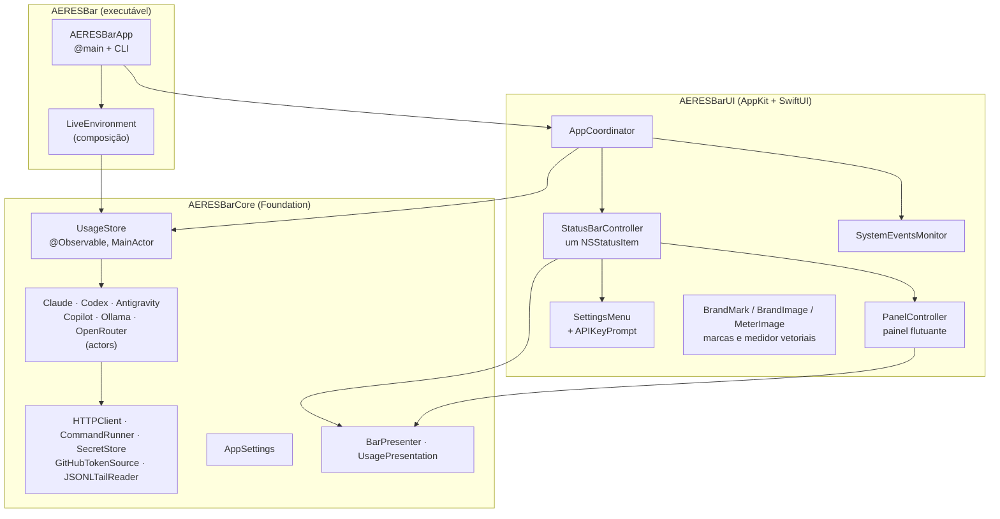

# Arquitetura do AERES Bar

Este documento explica como o app é organizado e por quê. Para instalar e usar, veja o [README](../README.md).

## Visão geral

As dependências andam numa só direção: `AERESBar → AERESBarUI → AERESBarCore`. O Core não importa AppKit nem SwiftUI, então tudo o que decide números e textos é testável em processo, sem sessão gráfica.

## Módulos

| Módulo | Responsabilidade | Principais tipos |
| --- | --- | --- |
| `AERESBarCore` | Modelos, leitura das fontes, estado e textos | `ProviderSnapshot`, `UsageWindow`, `UsageProvider`, `FetchPolicy`, `UsageStore`, `AppSettings`, `SecretStore`, `BarPresenter`, `UsagePresentation`, `CLICommand` |
| `AERESBarUI` | Tudo que aparece na tela | `AppCoordinator`, `StatusBarController`, `MeterImage`, `PanelController`, `ProviderSection`, `SettingsMenu`, `APIKeyPrompt`, `BrandMark`, `BrandImage`, `PreviewRenderer` |
| `AERESBar` | Ponto de entrada e composição | `AERESBarApp`, `AppDelegate`, `LiveEnvironment`, `CommandLineTool` |

## Fluxo de dados

1. O `AppCoordinator` inicia o `UsageStore` com atualização automática (padrão de 2 min) e escuta eventos do sistema: acordar do repouso, Antigravity abrindo ou fechando, provedores ligados ou desligados no menu.
2. O `UsageStore` pede a cada provedor ligado um novo `ProviderSnapshot`, passando o anterior e o motivo (`RefreshReason`: automático ou manual). Os provedores são `actor`s e rodam em paralelo. Um pedido feito enquanto outro está em andamento para o mesmo provedor espera o que já está rodando, em vez de disparar outro.
3. Cada provedor devolve **sempre** um snapshot. Uma falha não lança erro: vira `markFailed(ProviderIssue)`, que mantém os limites já lidos visíveis (`stale`) e registra o motivo (`issue` + `message`).
4. O store publica o resultado (`@Observable`) e grava o cache em disco (`SnapshotPersisting`).
5. A barra (`withObservationTracking`) e o painel (SwiftUI) se redesenham. Os textos vêm de `BarPresenter` e `UsagePresentation`, funções puras do snapshot e do instante atual. `BarPresenter.overall` junta todos os provedores no item único: o número do mais crítico e um nível por provedor para o medidor.

## Provedores

| Provedor | Limites | Credencial | Tokens e extras | Plano B |
| --- | --- | --- | --- | --- |
| Claude Code | `GET api.anthropic.com/api/oauth/usage` | Chaves (*Claude Code-credentials*) via `/usr/bin/security`, reserva `~/.claude/.credentials.json` | `~/.claude/projects/**/*.jsonl` | último dado lido |
| Codex | `GET chatgpt.com/backend-api/wham/usage` | `~/.codex/auth.json` (validade do JWT verificada antes) | `~/.codex/sessions/**/rollout-*.jsonl` | último `rate_limits` gravado nos rollouts |
| Antigravity | `POST 127.0.0.1:<porta>/exa.language_server_pb.LanguageServerService/{GetUserStatus,RetrieveUserQuotaSummary}` | Token CSRF da linha de comando do processo | não disponível | último dado lido |
| GitHub Copilot | `GET api.github.com/copilot_internal/user` (`quota_snapshots`) | `gh auth token`, `hosts.yml` do `gh`, `~/.config/github-copilot/{apps,hosts}.json`, `GH_TOKEN`/`GITHUB_TOKEN` | não disponível | último dado lido |
| Ollama | `GET ollama.com/api/usage` (`limits.session`, `limits.weekly`, fração de 0 a 1) | Chave da API no Chaves (ou `OLLAMA_API_KEY`) | Servidor local: `/api/version` e `/api/ps` | último dado lido |
| OpenRouter | `GET openrouter.ai/api/v1/key` (limite da chave, cota de modelos gratuitos) | Chave da API no Chaves (ou `OPENROUTER_API_KEY`) | Gasto por período; saldo em `/api/v1/credits` com chave de gerenciamento | último dado lido |

Quem não está instalado ou configurado devolve `notInstalled`: some do medidor e aparece no rodapé do painel ("Não configurados"). O Ollama sem chave, com o servidor local rodando, mostra só o servidor: modelos locais não têm limite.

### Por que não renovar credenciais

Renovar um token OAuth rotaciona o *refresh token*. Se o AERES Bar renovasse por conta própria, o Claude Code ou o Codex poderiam ficar com um refresh token invalidado e deslogar. O app só **lê** a credencial atual: quando ela expira, mostra os últimos limites, e a ferramenta a renova no próximo uso.

### Política de consultas (`FetchPolicy` e `FetchState`)

- Nas atualizações automáticas, uma resposta recente é reaproveitada: 3 min na Anthropic, que responde 429 depois de poucas chamadas em alguns minutos, e 1 min nas demais APIs. Passar o mouse sobre a barra (que pede atualização se a leitura tiver mais de 30 s) não vira uma chamada de API.
- **Atualizar agora** (`RefreshReason.manual`) ignora esse reaproveitamento, mas não para respostas de menos de 15 s, para que cliques repetidos não inundem a API.
- HTTP 429: o provedor pausa até o `Retry-After` (segundos ou data HTTP), limitado entre 30 s e 30 min, ou por 5 min se o cabeçalho não vier. A pausa vale também para o botão. No GitHub, um 403 com `X-RateLimit-Remaining: 0` conta como 429.
- `FetchState` guarda, dentro de cada ator, a última resposta boa e a pausa em curso. Nos provedores com chave de API, trocar ou remover a chave zera esse estado e o snapshot anterior, para que os limites de uma chave nunca apareçam como se fossem de outra.

### Chaves de API (`SecretStore`)

`KeychainSecretStore` guarda as chaves do OpenRouter e do Ollama Cloud no Chaves, serviço *AERES Bar*, por meio do `/usr/bin/security`:

- **Leitura:** `find-generic-password -s "AERES Bar" -a <conta> -w`. Sem item, vale a variável de ambiente da ferramenta (`OPENROUTER_API_KEY`, `OLLAMA_API_KEY`).
- **Gravação:** o comando `add-generic-password -U …` vai pela **entrada padrão** de `security -i`, nunca nos argumentos, que qualquer processo pode listar com `ps`. Antes disso, a chave é validada: 8 a 512 caracteres ASCII visíveis, sem aspas nem barra invertida, o que também impede injeção no comando interativo.
- **Por que o `security` e não o framework Security:** o item passa a confiar na ferramenta, e não na assinatura do app. Assim, a leitura não pede senha, nem depois de uma atualização que mude a assinatura ad-hoc.
- **Linha de comando:** `--set-key` lê a chave com `readpassphrase` (sem eco) quando roda num terminal, ou da entrada padrão num pipe.

### Antigravity

O agente (`Antigravity.app`) inicia seu `language_server` com `--https_server_port 0` (porta aleatória) e `--csrf_token <uuid>`; o IDE usa `--extension_server_port`. O `LanguageServerLocator` encontra os processos com `ps`, as portas com `lsof` e testa cada uma (HTTPS primeiro). O endpoint que funcionou fica memorizado para as próximas leituras. O JSON do protocolo Connect omite valores zero (proto3), então uma cota sem `remainingFraction` está **esgotada**.

### GitHub Copilot

O endpoint `copilot_internal/user` é o mesmo que as extensões do Copilot usam para mostrar as cotas. Cada cota de `quota_snapshots` vira uma janela mensal com `100 − percent_remaining`; cotas `unlimited` viram detalhe ("ilimitado") e cotas com `entitlement` 0 (as requisições premium do plano Free) ficam de fora. O plano sai do `access_type_sku`: o do plano de estudante também contém "free", por isso é testado antes.

### Ollama

`OLLAMA_HOST` segue as regras do cliente do próprio Ollama: sem esquema, é http na porta 11434; com esquema, a porta padrão dele; host vazio é este Mac. A API da nuvem não informa quando as janelas renovam, então o painel não inventa uma contagem regressiva.

## Leitura incremental de logs

Os logs do Claude Code passam fácil de 1 GB por semana. Para não reler tudo:

- `RecentFiles` lista só `.jsonl` modificados nos últimos 8 dias.
- `JSONLTailReader` guarda o deslocamento lido de cada arquivo. As próximas passadas leem só os bytes novos. Uma linha sem `\n` final fica para depois, porque pode estar sendo escrita, e um arquivo que encolheu é relido do início.
- A leitura usa `read(2)` num buffer de 4 MB mapeado com `mmap`, que dobra se uma linha não couber e é devolvido ao sistema (`munmap`) ao fim de cada arquivo. A versão anterior lia blocos `Data` de 8 MB com `FileHandle`: os blocos voltavam com *autorelease* e, depois de liberados, ficavam no cache do `malloc`, contando na memória do app. A primeira passada chegava a 1,7 GB, e o app ficava com ~120 MB em repouso.
- Linhas são filtradas por `memmem` (`"type":"assistant"`, `"token_usage_record"`) antes de qualquer parse.
- Nas linhas do Claude, `ShallowJSON` percorre o objeto só no primeiro nível e só o objeto `usage` é decodificado. Os payloads de ferramentas, que são a maior parte dos bytes, nunca são parseados, e chaves `usage` dentro de conteúdo aninhado não confundem a leitura.
- `TokenLedger` indexa eventos por resposta: `messageId|requestId` no Claude, que grava a mesma resposta por bloco de conteúdo, e `response_id` ou o total acumulado no Codex, que repete eventos `token_count`.

Resultado medido num Mac com Apple Silicon: a primeira leitura, de 1,8 GB (493 arquivos dos últimos 8 dias), leva ~4,6 s em segundo plano, com pico de ~115 MB de memória; as seguintes levam ~0,1 s. Em repouso, o app fica em ~26 MB e ~0% de CPU.

## Concorrência

- Modo de linguagem Swift 6, checagem estrita, zero avisos.
- `UsageStore`, `AppSettings` e toda a UI são `@MainActor`. Os provedores são `actor`s e donos exclusivos de seus leitores de log e do seu `FetchState`, que não são thread-safe e não precisam ser.
- Temporizadores são `Task`s com `Task.sleep` (canceláveis), não `Timer`.
- Estado compartilhado fora de atores usa `OSAllocatedUnfairLock`, como na drenagem de pipes do `ProcessCommandRunner`. Um processo filho com saída grande não trava porque stdout e stderr são drenados em paralelo, e a drenagem começa antes de a entrada padrão ser escrita.

## Interface

- **Barra de menus:** um único `NSStatusItem`. O ícone é o `MeterImage`, uma imagem-modelo desenhada à mão com uma barra por provedor, cheia até o uso de cada um; o trilho vazio é translúcido e sobrevive à tintura do sistema. Ao lado, o número do provedor mais crítico em fonte monoespaçada para dígitos, com cor só nos alertas. O ajuste **Ícone na barra** troca o medidor pelo logo do provedor mais crítico.
- **Painel:** `NSPanel` sem borda e **não ativante**, que não rouba o foco do app em uso. Usa Liquid Glass (`NSGlassEffectView`) no macOS 26+ e material de popover antes disso. Mostra todos os provedores ligados: cada `ProviderSection` tem um resumo (uma linha por janela) e, ao clicar, os detalhes. O tamanho acompanha o conteúdo SwiftUI pela invalidação do tamanho intrínseco do `NSHostingView`; `onPreferenceChange` não era confiável dentro de um painel que não é janela principal.
- **Botão Atualizar:** enquanto o store atualiza, o ícone dá lugar a um `ProgressView`. A versão 1.0.0 girava o ícone com uma animação `repeatForever`, que ficava errática porque o painel se redesenha a cada segundo (`TimelineView`, para as contagens regressivas).
- **Hover:** uma `NSTrackingArea` no item abre o painel após 150 ms. Uma `Task` observa o ponteiro e fecha o painel 350 ms depois que ele sai do item, do painel e da faixa entre os dois. Com clique, monitores de evento fecham o painel com clique fora ou Esc.
- **Marcas oficiais:** os caminhos vetoriais vêm dos SVGs que os próprios fornecedores distribuem: `claude-logo.svg` da extensão do Claude Code, `blossom-black.svg` da extensão do Codex e `jetski-logo-black.svg` do Antigravity IDE; a do Copilot vem dos Octicons do GitHub (`copilot-24`), e as do Ollama e do OpenRouter, do Simple Icons. Um parser SVG próprio (`SVGPath`) cobre todos os comandos, arcos incluídos, e gera `Path`/`CGPath` nítidos em qualquer escala; marcas com vários caminhos são unidas com `CGPath.union`.

## Testes

| Suíte | Cobre |
| --- | --- |
| Formatação, timestamps, apresentação | Textos pt-BR, contagens regressivas, fusos, número da barra, item único (`BarPresenter.overall`), alertas |
| Parsers | Respostas reais anonimizadas (`Tests/AERESBarCoreTests/Fixtures`), incluindo os planos Free e Pro do Copilot, formatos antigos, entradas inválidas |
| Logs | Linhas parciais, truncamento, deduplicação, payloads aninhados enganosos |
| Provedores | `MockHTTPClient`, `ScriptedCommandRunner`, `StubCredentialSource`, `StubGitHubTokenSource`, `MemorySecretStore` e `TestClock`: sucesso, 401, 403, 429 + `Retry-After`, leitura manual, credencial expirada, troca e remoção de chave, falta de rede, fallback para logs, Antigravity fechado, servidor do Ollama parado |
| Infraestrutura | Entrada padrão dos processos, gravação de chaves sem argumentos, busca do login do GitHub, `OLLAMA_HOST` |
| Estado | Store (coalescência, paralelismo, provedores desligados, leitura manual, persistência), cache em disco, preferências |
| UI | Parser SVG, renderização das marcas (cobertura de pixels), medidor (pixels por barra), painel resumido e aberto via `ImageRenderer`, menu de ajustes e de chaves |

A cobertura mínima é aplicada no CI (`scripts/coverage.sh`).

## Decisões

| Decisão | Motivo |
| --- | --- |
| SwiftPM + script de empacotamento, sem projeto Xcode | Reprodutível no CI e no Terminal, diffs legíveis, sem `.pbxproj` |
| Nenhuma dependência de runtime | Superfície de ataque e manutenção mínimas; `swift-format` isolado em `BuildTools` |
| Um item só na barra, com um medidor por provedor | Com seis provedores, um item por provedor ocuparia metade da barra; o medidor mostra todos de relance e o número responde pelo mais crítico. Substituiu os três itens da 1.0.0 |
| Mais crítico como número padrão | Responde "quão perto estou de ser bloqueado?", seja pela sessão ou pela semana, em qualquer provedor |
| Não renovar tokens | Evita deslogar as ferramentas (ver acima) |
| Chaves pelo `security` com entrada padrão | Sem pedido de senha, sem a chave na lista de processos |
| Buffer mapeado (`mmap`) na leitura dos logs | Memória devolvida ao sistema na hora: sem blocos retidos por *autorelease* ou pelo cache do `malloc` (`malloc_zone_pressure_relief` não os devolvia) |
| Imagens do README com dados de exemplo | Determinísticas e sem expor o uso de ninguém |
