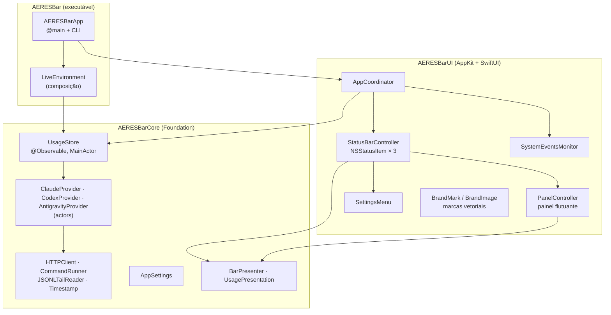

# Arquitetura do AERES Bar

Este documento explica como o app é organizado e por quê. Para instalar e usar, veja o [README](../README.md).

## Visão geral

As dependências andam numa só direção: `AERESBar → AERESBarUI → AERESBarCore`. O Core não importa AppKit nem SwiftUI, então tudo o que decide números e textos é testável em processo, sem sessão gráfica.

## Módulos

| Módulo | Responsabilidade | Principais tipos |
| --- | --- | --- |
| `AERESBarCore` | Modelos, leitura das fontes, estado e textos | `ProviderSnapshot`, `UsageWindow`, `UsageProvider`, `UsageStore`, `AppSettings`, `BarPresenter`, `UsagePresentation`, `CLICommand` |
| `AERESBarUI` | Tudo que aparece na tela | `AppCoordinator`, `StatusBarController`, `PanelController`, `SettingsMenu`, `BrandMark`, `BrandImage`, `PreviewRenderer` |
| `AERESBar` | Ponto de entrada e composição | `AERESBarApp`, `AppDelegate`, `LiveEnvironment`, `CommandLineTool` |

## Fluxo de dados

1. O `AppCoordinator` inicia o `UsageStore` com atualização automática (padrão de 2 min) e escuta eventos do sistema: acordar do repouso, Antigravity abrindo ou fechando.
2. O `UsageStore` pede a cada provedor um novo `ProviderSnapshot`, passando o anterior. Os provedores são `actor`s e rodam em paralelo. Um pedido feito enquanto outro está em andamento para o mesmo provedor espera o que já está rodando, em vez de disparar outro.
3. Cada provedor devolve **sempre** um snapshot. Uma falha não lança erro: vira `markFailed(ProviderIssue)`, que mantém os limites já lidos visíveis (`stale`) e registra o motivo (`issue` + `message`).
4. O store publica o resultado (`@Observable`) e grava o cache em disco (`SnapshotPersisting`).
5. A barra (`withObservationTracking`) e o painel (SwiftUI) se redesenham. Os textos vêm de `BarPresenter` e `UsagePresentation`, funções puras do snapshot e do instante atual.

## Provedores

| | Claude Code | Codex | Antigravity |
| --- | --- | --- | --- |
| Limites | `GET api.anthropic.com/api/oauth/usage` | `GET chatgpt.com/backend-api/wham/usage` | `POST 127.0.0.1:<porta>/exa.language_server_pb.LanguageServerService/{GetUserStatus,RetrieveUserQuotaSummary}` |
| Credencial | Chaves (*Claude Code-credentials*) via `/usr/bin/security`, reserva `~/.claude/.credentials.json` | `~/.codex/auth.json` (validade do JWT verificada antes) | Token CSRF da linha de comando do processo |
| Tokens | `~/.claude/projects/**/*.jsonl` | `~/.codex/sessions/**/rollout-*.jsonl` | não disponível |
| Plano B | último dado lido | último `rate_limits` gravado nos rollouts | último dado lido |

### Por que não renovar credenciais

Renovar um token OAuth rotaciona o *refresh token*. Se o AERES Bar renovasse por conta própria, o Claude Code ou o Codex poderiam ficar com um refresh token invalidado e deslogar. O app só **lê** a credencial atual: quando ela expira, mostra os últimos limites, e a ferramenta a renova no próximo uso.

### Política de consultas (`FetchPolicy`)

- Uma resposta recente é reaproveitada: 3 min na Anthropic, que responde 429 depois de poucas chamadas em alguns minutos, e 1 min no ChatGPT. Passar o mouse sobre a barra (que pede atualização se a leitura tiver mais de 30 s) não vira uma chamada de API.
- HTTP 429: o provedor pausa até o `Retry-After` (segundos ou data HTTP), limitado entre 30 s e 30 min, ou por 5 min se o cabeçalho não vier.

### Antigravity

O agente (`Antigravity.app`) inicia seu `language_server` com `--https_server_port 0` (porta aleatória) e `--csrf_token <uuid>`; o IDE usa `--extension_server_port`. O `LanguageServerLocator` encontra os processos com `ps`, as portas com `lsof` e testa cada uma (HTTPS primeiro). O endpoint que funcionou fica memorizado para as próximas leituras. O JSON do protocolo Connect omite valores zero (proto3), então uma cota sem `remainingFraction` está **esgotada**.

## Leitura incremental de logs

Os logs do Claude Code passam fácil de 1 GB por semana. Para não reler tudo:

- `RecentFiles` lista só `.jsonl` modificados nos últimos 8 dias.
- `JSONLTailReader` guarda o deslocamento lido de cada arquivo. As próximas passadas leem só os bytes novos. Uma linha sem `\n` final fica para depois, porque pode estar sendo escrita, e um arquivo que encolheu é relido do início.
- Linhas são filtradas por `memmem` (`"type":"assistant"`, `"token_usage_record"`) antes de qualquer parse.
- Nas linhas do Claude, `ShallowJSON` percorre o objeto só no primeiro nível e só o objeto `usage` é decodificado. Os payloads de ferramentas, que são a maior parte dos bytes, nunca são parseados, e chaves `usage` dentro de conteúdo aninhado não confundem a leitura.
- `TokenLedger` indexa eventos por resposta: `messageId|requestId` no Claude, que grava a mesma resposta por bloco de conteúdo, e `response_id` ou o total acumulado no Codex, que repete eventos `token_count`.

Resultado medido: primeira leitura de ~1,3 GB em ~5 s em segundo plano; leituras seguintes em ~0,5 s, incluindo a rede.

## Concorrência

- Modo de linguagem Swift 6, checagem estrita, zero avisos.
- `UsageStore`, `AppSettings` e toda a UI são `@MainActor`. Os provedores são `actor`s e donos exclusivos de seus leitores de log, que não são thread-safe e não precisam ser.
- Temporizadores são `Task`s com `Task.sleep` (canceláveis), não `Timer`.
- Estado compartilhado fora de atores usa `OSAllocatedUnfairLock`, como na drenagem de pipes do `ProcessCommandRunner`. Um processo filho com saída grande não trava porque stdout e stderr são drenados em paralelo.

## Interface

- **Barra de menus:** três `NSStatusItem` com imagens-modelo (o sistema aplica a cor da barra) e título em fonte monoespaçada para dígitos. Cores só nos alertas.
- **Painel:** `NSPanel` sem borda e **não ativante**, que não rouba o foco do app em uso. Usa Liquid Glass (`NSGlassEffectView`) no macOS 26+ e material de popover antes disso. O tamanho acompanha o conteúdo SwiftUI pela invalidação do tamanho intrínseco do `NSHostingView`; `onPreferenceChange` não era confiável dentro de um painel que não é janela principal.
- **Hover:** uma `NSTrackingArea` por item abre o painel após 150 ms. Uma `Task` observa o ponteiro e fecha o painel 350 ms depois que ele sai do item, do painel e da faixa entre os dois. Com clique, monitores de evento fecham o painel com clique fora ou Esc.
- **Marcas oficiais:** os caminhos vetoriais vêm dos SVGs que os próprios fornecedores distribuem: `claude-logo.svg` da extensão do Claude Code, `blossom-black.svg` da extensão do Codex e `jetski-logo-black.svg` do Antigravity IDE. Um parser SVG próprio (`SVGPath`) cobre todos os comandos, arcos incluídos, e gera `Path`/`CGPath` nítidos em qualquer escala.

## Testes

| Suíte | Cobre |
| --- | --- |
| Formatação, timestamps, apresentação | Textos pt-BR, contagens regressivas, fusos, número da barra, alertas |
| Parsers | Respostas reais anonimizadas (`Tests/AERESBarCoreTests/Fixtures`), formatos antigos, entradas inválidas |
| Logs | Linhas parciais, truncamento, deduplicação, payloads aninhados enganosos |
| Provedores | `MockHTTPClient`, `ScriptedCommandRunner`, `StubCredentialSource` e `TestClock`: sucesso, 401, 429 + `Retry-After`, credencial expirada, falta de rede, fallback para logs, Antigravity fechado |
| Estado | Store (coalescência, paralelismo, persistência), cache em disco, preferências |
| UI | Parser SVG, renderização das marcas (cobertura de pixels), painel completo via `ImageRenderer`, menu de ajustes |

A cobertura mínima é aplicada no CI (`scripts/coverage.sh`).

## Decisões

| Decisão | Motivo |
| --- | --- |
| SwiftPM + script de empacotamento, sem projeto Xcode | Reprodutível no CI e no Terminal, diffs legíveis, sem `.pbxproj` |
| Nenhuma dependência de runtime | Superfície de ataque e manutenção mínimas; `swift-format` isolado em `BuildTools` |
| Três itens na barra em vez de um | Tintura nativa por item, reordenação com ⌘-arrastar e hover por provedor |
| Mais crítico como número padrão | Responde "quão perto estou de ser bloqueado?", seja pela sessão ou pela semana |
| Não renovar tokens | Evita deslogar as ferramentas (ver acima) |
| Imagens do README com dados de exemplo | Determinísticas e sem expor o uso de ninguém |
